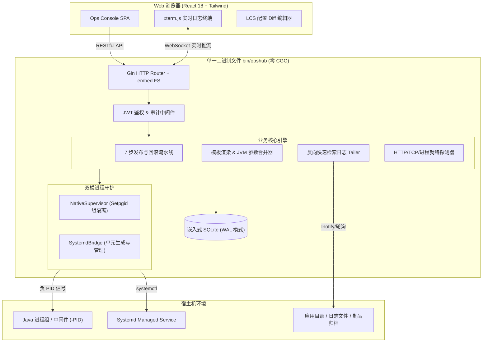

# OpsHub 运维发布平台用户使用手册

<div align="center">

**现代化轻量级单机应用运维与部署平台**  
*Single-Binary Java & Middleware Operations Console*

[](https://golang.org)
[](https://react.dev)
[](#)
[](#)

</div>

---

## 目录 (Table of Contents)

1. [平台概述 (Platform Overview)](#1-平台概述-platform-overview)
2. [环境要求与安装部署 (Installation & Setup)](#2-环境要求与安装部署-installation--setup)
   - [2.1 依赖准备](#21-依赖准备)
   - [2.2 源码编译 (单二进制打包)](#22-源码编译-单二进制打包)
   - [2.3 快速启动与初始登录](#23-快速启动与初始登录)
3. [核心架构与运行原理 (Architecture & Core Concepts)](#3-核心架构与运行原理-architecture--core-concepts)
   - [3.1 单二进制静态分发 (`embed.FS`)](#31-单二进制静态分发-embedfs)
   - [3.2 双模进程守护体系 (Native PGID vs Systemd)](#32-双模进程守护体系-native-pgid-vs-systemd)
   - [3.3 7 步就绪式发布流水线与安全回滚机制](#33-7-步就绪式发布流水线与安全回滚机制)
4. [功能模块操作指南 (User Guide)](#4-功能模块操作指南-user-guide)
   - [4.1 概览看板与系统指标 (Dashboard & Metrics)](#41-概览看板与系统指标-dashboard--metrics)
   - [4.2 JDK 资产管理 (JDK Assets)](#42-jdk-资产管理-jdk-assets)
   - [4.3 部署模板工作室 (Template Studio)](#43-部署模板工作室-template-studio)
   - [4.4 服务舰队与实例详情 (Service Fleet & Detail)](#44-服务舰队与实例详情-service-fleet--detail)
   - [4.5 7 步版本发布与一键秒级回滚 (Deployment & Rollback)](#45-7-步版本发布与一键秒级回滚-deployment--rollback)
   - [4.6 实时日志流终端 (`xterm.js` Console)](#46-实时日志流终端-xtermjs-console)
   - [4.7 在线配置编辑器与 LCS 差异比对 (Config Diff Editor)](#47-在线配置编辑器与-lcs-差异比对-config-diff-editor)
   - [4.8 安全中心与全链路审计轨迹 (Audit Logs)](#48-安全中心与全链路审计轨迹-audit-logs)
5. [OpenAPI 接口与 WebSocket 协议 (API Specification)](#5-openapi-接口与-websocket-协议-api-specification)
6. [故障排查与运维常见问题 (FAQ & Troubleshooting)](#6-故障排查与运维常见问题-faq--troubleshooting)

---

## 1. 平台概述 (Platform Overview)

**OpsHub** 是一款专为 Java 应用（Spring Boot、微服务体系）及各类中间件设计的轻量级、自包含单机部署与运维控制台。

### 核心特性矩阵

| 特性分类 | 功能亮点 | 技术实现 |
| :--- | :--- | :--- |
| **极致交付** | 单静态二进制文件交付，无任何动态依赖 | 纯 Go（零 CGO，`modernc.org/sqlite`）+ Vite 静态资源 `embed.FS` 嵌入 |
| **进程治理** | 原生进程组强隔离，杜绝孤儿/僵尸进程；无缝集成 Linux 系统级服务 | `Setpgid: true` 负 PID 信号组广播 + Systemd 单元自动渲染与 `systemctl` 桥接 |
| **高可用发布** | 原地（In-Place）7步发布机制，健康探测失败秒级自动回滚 | 预检 → 原地备份 → 停机 → 制品解压覆盖 → 启动 → Actuator/TCP 就绪探测 → 记录生效 |
| **沉浸式监控** | 极客暗黑终端视觉、xterm 实时日志流、在线配置版本比对 | Cyberpunk 暗色主题、WebSocket 倒序检索日志、动态规划 LCS 差异比对 |
| **安全合规** | 生产级无状态身份认证、不可抵赖的变更审计追踪 | HMAC-SHA256 JWT、Bcrypt 密钥派生、全局 HTTP 变更脱壳异步审计中间件 |

---

## 2. 环境要求与安装部署 (Installation & Setup)

### 2.1 依赖准备

- **构建机器环境**（若直接使用编译好的二进制包则无需满足此条）：
  - Go 1.22 或更高版本
  - Node.js 18+ 及 npm 9+
  - Make 工具
- **目标部署机器环境**：
  - Linux（主流发行版如 Ubuntu、CentOS、Debian、Rocky 等）或 macOS
  - 系统具备 `sh`、`tar`、`ps` 及基础工具集
  - 若需要 Systemd 托管，操作系统需支持 `systemd` 并具备 `systemctl` 权限

### 2.2 源码编译 (单二进制打包)

OpsHub 提供了集成化的 `Makefile`，一键自动化完成前端构建、静态嵌入与跨平台静态二进制打包：

```bash
# 克隆代码库
git clone https://github.com/xiaotang2024/OpsHub.git
cd OpsHub

# 一键编译完整平台（自动构建前端并内嵌到二进制文件中）
make build-all
```

编译完成后，将在项目根目录的 `bin/` 目录下生成独立的单一可执行文件：
```bash
ls -lh bin/opshub
# 产物大小约为 30MB 左右，包含完整的后端 API 服务与前端交互界面
```

### 2.3 快速启动与初始登录

直接执行二进制文件启动平台：

```bash
./bin/opshub
```

#### 启动控制台输出示例：
```text
============================================================
              OpsHub Operations Platform                    
============================================================
[Init] Admin user created with default password:
------------------------------------------------------------
Password: [ a8F3b9K2xL7mQ1pZ ]
------------------------------------------------------------
[Security Notice] Please save this password and change it immediately!
============================================================
[Server] Listening and serving HTTP on 0.0.0.0:8080
```

> [!IMPORTANT]
> - **首次启动**：系统检测到用户表为空时，会自动生成 `admin` 超级管理员账号及随机高强度初始密码（并在终端控制台中高亮打印）。
> - 请妥善保存该密码，启动后第一时间进入系统修改。
> - **数据持久化位置**：默认数据存储在 `~/.opshub/` 目录下，包含 SQLite 数据库、安装目录与制品仓库归档。可通过环境变量指定自定义路径：
>   ```bash
>   OPSHUB_PORT=9090 OPSHUB_DATA_DIR=/data/opshub ./bin/opshub
>   ```

#### 浏览器访问与登录：
1. 浏览器打开 `http://localhost:8080`，若当前未登录，系统会自动弹出 **OpsHub 控制台登录** 弹窗。
2. 默认用户名为 `admin`，密码输入上方启动终端中打印的一次性初始密码。
3. 点击 **确认登录**，系统将自动校验凭据并保存 JWT Token，立即加载服务舰队与模板数据。
4. 如需退出登录，点击左侧导航栏底部的 **退出登录 (LogOut)** 图标即可安全清除凭证。

---

## 3. 核心架构与运行原理 (Architecture & Core Concepts)



### 3.1 单二进制静态分发 (`embed.FS`)
OpsHub 使用 Go 标准库 `embed.FS` 技术，在编译期将前端生产构建产物（HTML、CSS、JS、静态资源）完整压缩并嵌入 Go 符号表中。
- 启动时自动通过统一端口提供 REST API 与 SPA 前端界面。
- 支持前端 HTML5 History 路由无刷新回退，同时对未匹配的 `/api/*` 请求精准返回 404 JSON，避免产生重定向污染。

### 3.2 双模进程守护体系 (Native PGID vs Systemd)
OpsHub 为不同场景提供两种进程管理模式：
1. **Native 原生守护模式**：
   - 适用于无需 root 权限的场景。
   - 进程派生时强制启用 `SysProcAttr{Setpgid: true}` 创建独立进程组。
   - 停止或重启时，向负 PID 发送 `SIGTERM` 信号（如 `kill(-pid, SIGTERM)`），确保子进程、Shell 包装器等全进程树优雅退出；超时未退出则强制执行 `SIGKILL`。
   - 内置孤儿进程防卫，严密拦截 `PID <= 1`，避免 POSIX 广播杀伤。
2. **Systemd 桥接模式**：
   - 适用于生产系统标准化服务治理。
   - 自动生成符合 Linux 标准的 Systemd 单元文件（`/etc/systemd/system/opshub-<service>.service`）。
   - 具备进程崩溃自动拉起、开机自启与系统级 cgroup 资源隔离能力。

### 3.3 7 步就绪式发布流水线与安全回滚机制

发布不是简单的“覆盖并启动”。OpsHub 严格遵循生产级标准原子流水线：

```mermaid
sequenceDiagram
    autonumber
    participant UI as 控制台 (Web UI)
    participant Pipe as 发布流水线 (DeployPipeline)
    participant FS as 宿主机文件系统
    participant Sup as 进程守护器 (Supervisor)
    participant Probe as 就绪探测器 (Prober)
    participant DB as SQLite 数据库

    UI->>Pipe: 触发发布 (指定制品与服务)
    Pipe->>Pipe: 步骤 1: 预检 (校验文件哈希、路径安全)
    Pipe->>FS: 步骤 2: 原地备份 (备份旧版至 .bak)
    Pipe->>Sup: 步骤 3: 停机 (优雅停止正在运行的进程)
    Pipe->>FS: 步骤 4: 制品解压覆盖 (分发解压至安装目录)
    Pipe->>Sup: 步骤 5: 启动新版本 (注入 JVM 选项与环境变量)
    
    rect rgb(20, 35, 50)
    Note over Pipe,Probe: 探测阶段 (严禁过早更新生效版本)
    Pipe->>Probe: 步骤 6: 就绪探测 (执行 HTTP Actuator / TCP 探活)
    alt 探测成功
        Probe-->>Pipe: 健康状态 OK (HTTP 200)
        Pipe->>DB: 步骤 7: 记录生效 (正式提交 current_artifact_id)
        Pipe-->>UI: 发布成功完成
    else 探测超时或异常
        Probe-->>Pipe: 探测失败 (连接拒绝或超时)
        Note over Pipe,FS: 触发安全自动回滚
        Pipe->>Sup: 停止异常进程
        Pipe->>FS: 从 .bak 还原旧版本文件
        Pipe->>Sup: 重启旧版本服务
        Pipe->>DB: 标记发布失败，保留旧版本生效记录
        Pipe-->>UI: 报告发布失败并完成自动回滚
    end
    end
```



---

## 4. 功能模块操作指南 (User Guide)

### 4.1 概览看板与系统指标 (Dashboard & Metrics)

登录系统后，默认进入主工作台界面：
- **实时资源监测仪表盘**：动态展示宿主机 CPU 核心利用率、物理内存占用（已用/总量）、磁盘剩余容量与已托管的服务统计。
- **健康指示灯 (Status Beacon)**：顶部状态栏实时指示与 OpsHub 核心后端的连接延时与健康心跳。
- **多主题切换 (Theme Switcher)**：
  - 顶部导航栏常驻调色盘主题切换按钮，支持用户随时自由切换 3 种高质量风格主题：
    1. **极客暗夜 (Cyber Slate)**：默认经典暗夜底色（`#0B0F17`）搭配磷光青蓝（`#06B6D4`）与翠绿脉冲。
    2. **天水雾蓝 (Mist & Celadon)**：主配色由 **天水碧（#5fa3b0）**、**雾蓝（#2d5678）** 与 **鲸灰（#475061）** 匠心调配，水色与幽蓝辉映，清雅深邃。
    3. **木紫茶岩 (Wood & Terracotta)**：主配色由 **木紫（#4b4e72）**、**茶色（#aa5140）** 与 **熔岩灰（#606165）** 搭配构建，内敛赤茶点缀紫岩质感，沉稳古雅。
  - 所选主题自动实时保存至浏览器本地存储（`opshub_theme`），刷新或下次访问自动维持该风格。

### 4.2 JDK 资产管理 (JDK Assets)

在 **JDK 资产** 页面集中治理宿主机上的 Java 运行时环境：

1. **自动扫描 (Auto-Scan)**：
   - 点击 **“扫描系统 JDK”** 按钮，系统将自动检索以下标准路径：
     - macOS：`/Library/Java/JavaVirtualMachines/*/Contents/Home`
     - Linux：`/usr/lib/jvm/*`、`/opt/java/*`
     - 当前宿主机环境变量 `$JAVA_HOME`
   - 自动执行 `java -version` 提取版本号（如 Java 8, 11, 17, 21）及供应商信息并入库。
2. **手动注册 (Manual Registration)**：
   - 点击 **“注册 JDK”**，填入自定义名称（如 `OpenJDK-21-LTS`）及 `bin/java` 绝对路径，系统自动预检可执行性与版本号。

### 4.3 部署模板工作室 (Template Studio)

部署模板实现了“运维配置标准化”，将 JVM 调优参数、目录规范、探测规则解耦为可复用资产。

1. **可视化 JVM 调优滑块**：
   - **堆内存范围交互**：直观拖动设置堆内存初始值（`-Xms`）与最大值（`-Xmx`），单位支持 MB / GB。
   - **垃圾回收器一键切换**：快速选定 G1GC、ZGC、ParallelGC 或 CMS，自动合成对应的 JVM 核心参数（如 `-XX:+UseG1GC`、`-XX:+UseZGC`）。
   - **OOM 转储与 GC 日志**：默认自动注入 `-XX:+HeapDumpOnOutOfMemoryError`，保障故障现场可回溯。
   - **实时参数预览**：右侧代码框实时生成合成后的完整 JVM 启动参数。
2. **变量插值语法**：
   - 在启动命令中支持丰富的动态宏变量：
     - `${JAVA_BIN}`：关联 JDK 的执行程序绝对路径。
     - `${PORT}`：分配给该服务的运行端口。
     - `${INSTALL_DIR}`：该服务的本地安装目录。
     - `${PACKAGE_FILE}`：已部署的制品文件名。
     - `${JVM_OPTIONS}`：合并后的最终 JVM 参数。
3. **健康检查规范**：
   - 支持 `HTTP`（如 Actuator `/actuator/health`）、`TCP`（端口监听检测）与 `PROCESS`（进程 PID 存活性检测）。

### 4.4 服务舰队与实例详情 (Service Fleet & Detail)

在 **服务列表 (Services)** 中，所有实例以卡片矩阵形式陈列：

1. **动态状态徽章 (Status Badge)**：
   - **运行中 (RUNNING)**：磷光翠绿发光点 + `animate-ping` 动态声呐扩散脉冲。
   - **启动中 (STARTING)**：琥珀黄呼吸旋转指示器。
   - **已停止 (STOPPED)**：低饱和度暗红色警示点。
   - **异常 (FAILED)**：猩红闪烁报警指示。
2. **快捷生命周期管理**：
   - 卡片上可直接执行 **启动 (Start)**、**停止 (Stop)**、**重启 (Restart)** 操作，按钮具备乐观更新防抖与加载转圈反馈。
3. **服务实例深度详情页 (`/services/:id`)**：
   - **概览 Tab**：展示进程 PID（支持一键复制）、实时 CPU / 内存 RSS 仪表盘、进程持续运行时间 Ticker、监听端口与关联模板。
   - **版本与发布 Tab**：历史发布事件时间轴、当前生效版本徽章、一键部署新版本及历史版本对比回滚。
   - **配置文件 Tab**：在线配置文件切换、实时编辑与差异比对。
   - **实时日志 Tab**：内嵌 xterm.js 高性能终端。
   - **审计轨迹 Tab**：针对该服务的变更操作完整流水。

### 4.5 7 步版本发布与一键秒级回滚 (Deployment & Rollback)

#### 发布新版本
1. 在服务详情的 **版本与发布** 标签页中点击 **“部署新版本”**。
2. **制品选择**：可将本地 `.jar` 或 `.tar.gz` 拖拽上传至制品库，或从已上传的制品列表中点选。
3. **启动发布流水线**：
   - 界面弹出 **7-Step 动画步骤条**，实时点亮当前步骤（预检 → 备份 → 停机 → 分发 → 启动 → 探测 → 生效）。
   - 步骤条实时显示各阶段耗时（Duration Ticker）。
   - 可展开底部终端面板实时查看发布控制台输出日志。
   - 若就绪探测失败，流水线自动触发阻断并执行回滚，保护生产环境不受异常版本破坏。

#### 一键秒级回滚
1. 在发布历史记录列表中，选择任意历史健康版本。
2. 点击 **“一键回滚”** 按钮唤起回滚对比弹窗。
3. 界面清晰展示 **当前生效版本 vs 目标回滚版本** 的文件名称、SHA-256 哈希值、发布人与时间差。
4. 点击确认后，系统自动从中心制品库调取历史归档包，执行安全替换重启，秒级恢复业务。

### 4.6 实时日志流终端 (`xterm.js` Console)

OpsHub 摒弃了低效的前端轮询拉取日志方案，基于 WebSocket 与高性能后端底层实现反向快速 Seek：

- **极速打开大文件**：即使日志文件高达数 GB，后端逆向移动文件指针快速截取末尾 N 行（最大限制 5,000 行，内存安全上限 8MB），毫秒级首屏加载。
- **终端交互控制台**：
  - **自动滚动锁定 (Auto-Scroll Lock)**：点击锁图标切换自由查看历史与跟随最新日志。
  - **实时关键词高亮与检索**：输入关键字（如 `ERROR`），终端即时显示匹配计数（如 `12 matches for "ERROR"`）并支持上下跳转定位。
  - **暂停/恢复推流 (Pause/Resume)**：暂停时后端数据进入内存安全环形缓冲区，恢复时平滑补发。
  - **清屏与日志下载**：一键清除当前屏幕，或直接导出完整本地 `.log` 文件。

### 4.7 在线配置编辑器与 LCS 差异比对 (Config Diff Editor)

在线修改配置文件的最大痛点是误修改与缺乏审核。OpsHub 提供了内置的 LCS (Longest Common Subsequence) 差异比对编辑器：

1. **多配置文件下拉选择**：自动加载安装目录下的 `application.yml`、`application.properties` 等文件。
2. **行号联动与代码编辑**：编辑框与左侧行号 Gutter 实现完美的像素级滚动同步。
3. **双重视图切换**：
   - **编辑模式 (Edit Mode)**：原生代码编辑区，支持语法高亮风格。
   - **差异模式 (Diff View)**：提供 **分栏对比 (Side-by-Side)** 与 **单列统一对比 (Inline Unified)** 两种展示形态。新增行高亮浅绿（`+`），删除行高亮浅红（`-`）。
4. **安全保护与自动快照**：
   - 界面显著常驻警示条：“修改后需重启服务以使配置生效”。
   - 点击保存时自动弹出变更确认框，精准列出 `+N additions, -M deletions`。
   - 保存时后端会自动在原目录下生成带时间戳的 `.bak` 备份文件（如 `application.yml.20260910-180000.bak`），确保任意误操作均可还原。

### 4.8 安全中心与全链路审计轨迹 (Audit Logs)

1. **密码修改**：右上角管理员个人中心支持安全修改登录凭证。
2. **全局审计中间件**：
   - 系统内置非阻塞审计拦截器，对所有具有破坏性/变更性的 HTTP 操作（`POST`, `PUT`, `DELETE`, `PATCH`）进行记录。
   - 记录要素涵盖：操作人（Operator）、客户端 IP、请求行为（Action）、操作对象（Target Type & ID）、执行结果状态（200/400/500）及变更摘要详情。
   - 审计任务脱离主请求生命周期，即使客户端中途关闭连接，审计记录依然安全持久化至 SQLite 数据库。

---

## 5. OpenAPI 接口与 WebSocket 协议 (API Specification)

所有受保护接口均需在 Header 中携带 JWT Token：`Authorization: Bearer <token>`。

### 认证接口
| 方法 | 路径 | 说明 |
| :--- | :--- | :--- |
| `POST` | `/api/auth/login` | 用户登录，返回 JWT Token |
| `POST` | `/api/auth/change-password` | 修改当前登录用户密码 |
| `GET` | `/api/auth/me` | 获取当前用户身份与角色信息 |

### 系统与指标
| 方法 | 路径 | 说明 |
| :--- | :--- | :--- |
| `GET` | `/api/system/health` | 平台健康状态探测（公开端点） |
| `GET` | `/api/system/metrics` | 宿主机 CPU、内存、磁盘实时指标 |
| `GET` | `/api/audit-logs` | 分页检索全局操作审计轨迹 |

### JDK 资产
| 方法 | 路径 | 说明 |
| :--- | :--- | :--- |
| `GET` | `/api/jdks` | 获取已注册的 JDK 列表 |
| `POST` | `/api/jdks` | 手动注册新的 JDK 路径 |
| `GET` | `/api/jdks/scan` | 触发宿主机系统 JDK 自动扫描并入库 |
| `DELETE` | `/api/jdks/:id` | 注销已登记的 JDK 资产 |

### 部署模板
| 方法 | 路径 | 说明 |
| :--- | :--- | :--- |
| `GET` | `/api/templates` | 获取部署模板列表 |
| `POST` | `/api/templates` | 创建新的标准化部署模板 |
| `PUT` | `/api/templates/:id` | 更新模板定义与 JVM 规范 |
| `DELETE` | `/api/templates/:id` | 删除未关联服务的模板 |

### 服务舰队
| 方法 | 路径 | 说明 |
| :--- | :--- | :--- |
| `GET` | `/api/services` | 获取所有托管服务列表及最新运行状态 |
| `POST` | `/api/services` | 基于模板创建新的应用服务 |
| `GET` | `/api/services/:id` | 获取指定服务的详细配置与指标 |
| `POST` | `/api/services/:id/start` | 启动服务实例 |
| `POST` | `/api/services/:id/stop` | 停止服务实例 |
| `POST` | `/api/services/:id/restart` | 重启服务实例（单响应原子处理） |
| `GET` | `/api/services/:id/configs` | 读取服务配置文件清单与内容 |
| `POST` | `/api/services/:id/configs` | 保存配置文件（自动生成 `.bak` 快照） |
| `GET` | `/api/services/:id/releases` | 获取该服务的历史发布与回滚记录 |
| `POST` | `/api/services/:id/deploy` | 触发 7 步就绪发布流水线 |
| `POST` | `/api/services/:id/rollback` | 触发指定历史版本的原子秒级回滚 |
| `WS` | `/api/services/:id/logs/ws` | WebSocket 实时日志流管道 |

---

## 6. 故障排查与运维常见问题 (FAQ & Troubleshooting)

### Q1: 启动服务提示端口被占用？
- **排查**：在控制台检查该服务配置的运行端口，或在宿主机执行 `lsof -i :<PORT>` 或 `netstat -tlpn | grep <PORT>`。
- **解决**：停止占用该端口的外部残留进程，或者在 OpsHub 服务配置中修改为可用端口。

### Q2: 为什么健康检查一直超时导致发布回滚？
- **排查**：
  1. 检查 Spring Boot 应用的健康检查路径是否配置正确（默认常为 `/actuator/health`）。
  2. 确认应用实际启动耗时是否超过了模板配置的 `probe_timeout`（例如大型应用冷启动需 60 秒，若探针超时设为 15 秒则会提前判定失败）。
  3. 查看服务日志输出，检查应用是否存在数据库连接失败、配置项缺失等报错。
- **解决**：在模板中适当调大 `超时时间 (timeout)`，修复应用配置后重新发布。

### Q3: Native 守护模式下停止服务，子进程是否会残留？
- **解答**：不会。OpsHub 在 Native 模式下会调用 `Setpgid: true`，将整个进程树归属于独立进程组。在停止或重启时，向负 PID（`-pid`）发送广播信号，彻底杀死所有衍生子进程。

### Q4: 使用 Systemd 模式提示权限不足？
- **排查**：Systemd 模式需要生成 `/etc/systemd/system/` 单元文件并调用 `systemctl daemon-reload`。
- **解决**：
  - 方式 A：以 `root` 权限或具备 `sudo` 免密权限的用户运行 `opshub`。
  - 方式 B：若无系统级 root 权限，在服务创建时将守护模式切换为 **Native (原生进程组)** 模式即可，无需任何特殊系统权限。

### Q5: 平台数据如何备份与迁移？
- **备份**：只需备份 `~/.opshub/`（或自定义的 `OPSHUB_DATA_DIR`）目录即可，该目录包含了 SQLite 数据库文件（`opshub.db`）、制品仓库归档（`packages/`）以及所有服务的持久化数据。
- **迁移**：将数据目录复制到目标服务器，并将 `opshub` 二进制可执行文件复制过去，启动即可完整恢复。

### Q6: 忘记管理员登录密码或未记录控制台初始密码如何重置？
- **解答**：OpsHub 支持通过 CLI 标志直接一键重置管理员密码，无需手动修改数据库：
  ```bash
  # 重置管理员密码为自定义密码（例如 admin123）
  ./bin/opshub -reset-password admin123
  ```
  重置成功后，在 Web 登录界面使用用户名 `admin` 和新密码 `admin123` 即可直接登入。

---

*OpsHub — 专注极致工程效能，为单机应用运维提供坚实后盾。*
