# OpsHub 运维发布平台开发者与架构手册

**面向平台维护与二次开发工程师的技术架构与实现规范**  
*System Architecture, Engineering Principles & Implementation Guide*

---

## 目录

1. [架构总览](#1-架构总览)
   - 1.1 系统整体分层架构图
   - 1.2 关键架构设计原则
2. [技术选型与取舍分析](#2-技术选型与取舍分析)
   - 2.1 后端技术栈与权衡考量
   - 2.2 前端技术栈与交互取舍
   - 2.3 存储与数据引擎选型
3. [项目目录结构与职责边界](#3-项目目录结构与职责边界)
   - 3.1 后端工程组织与模块职责
   - 3.2 前端工程组织与模块职责
4. [核心数据模型规范](#4-核心数据模型规范)
   - 4.1 实体关系模型 (ER 图)
   - 4.2 数据库表结构全量字典
5. [核心业务流程与实现原理](#5-核心业务流程与实现原理)
   - 5.1 身份认证、密码找回与细粒度权限控制
   - 5.2 非阻塞异步审计中间件
   - 5.3 跨平台 JDK 探测与指纹识别
   - 5.4 模板渲染引擎与参数继承优先级
   - 5.5 双模进程守护体系
   - 5.6 多协议健康探测器
   - 5.7 7 步高可用发版流水线与原子回滚状态机
   - 5.8 制品生命周期与生效版本保护策略
   - 5.9 大日志反向寻址推流与轮转自愈
   - 5.10 在线配置差异对比与原子快照
6. [RESTful API 接口规范](#6-restful-api-接口规范)
7. [WebSocket 实时通讯协议规范](#7-websocket-实时通讯协议规范)
8. [本地开发与构建打包流程](#8-本地开发与构建打包流程)
9. [质量保证与自动化测试策略](#9-质量保证与自动化测试策略)
10. [已知系统限制与未来演进方向](#10-已知系统限制与未来演进方向)
11. [附录](#11-附录)
    - 11.1 架构术语表
    - 11.2 版本变更记录

---

## 1. 架构总览

OpsHub 是面向单物理机、虚拟机或离线隔离节点构建的轻量级单机应用运维与部署平台。系统在架构设计上追求极简交付、高自包含、强隔离进程生命周期管理以及零外部中间件依赖。

### 1.1 系统整体分层架构图

下图展示了从 Web 客户端界面、网络路由层、核心领域服务层、进程守护与探测层到宿主机文件系统与操作系统内核的分层调用流向：

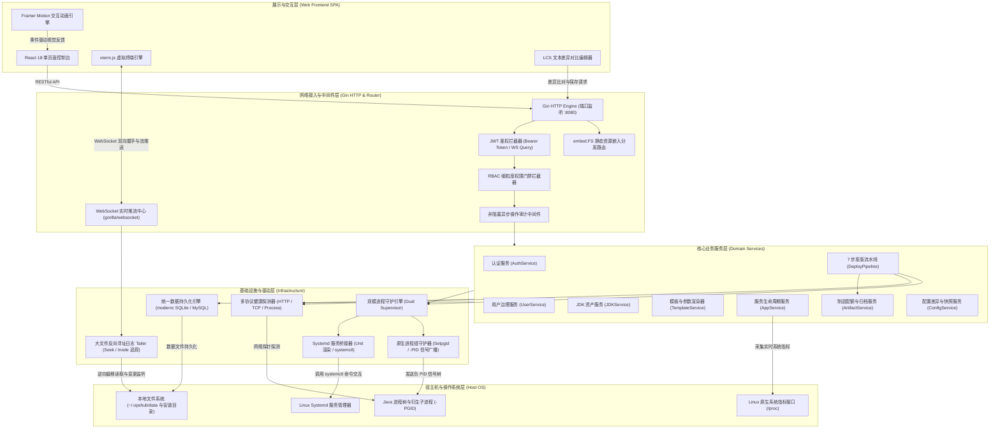

#### 架构图流转解析：
1. **客户端层**：基于现代化 React 18 SPA 架构，所有页面状态与后端仅通过无状态 RESTful API 及 WebSocket 长连接交互，前后端彻底分离；
2. **网络接入层**：通过 Gin 引擎统一处理 HTTP 请求分发，利用嵌入式文件系统直接挂载前端编译产物；请求按序穿过 JWT 认证中间件、RBAC 权限中间件以及后置异步审计中间件；
3. **领域服务层**：封装发版流水线、参数组装、用户权限、制品版本等核心业务逻辑，各服务间依赖解耦，状态变更统一同步至数据库；
4. **基础设施层**：屏蔽不同操作系统与不同部署模式的底层差异，以抽象接口向上暴露进程生命周期操作（启动、停机、探测、日志寻址）；
5. **宿主机层**：通过原生系统调用和文件读写直接调度进程与磁盘资产，无任何黑盒容器代理。

---

### 1.2 关键架构设计原则

1. **单静态二进制自包含交付 (Single-Binary Self-Containment)**：
   全系统打包为唯一一个无外部动态链接依赖的独立可执行文件，内嵌完整前端 Web 资源及纯 Go 实现的嵌入式数据库驱动。无需单独配置 Nginx、Node.js 运行时或预装外部数据库，单命令即可启动。
2. **进程组强隔离与孤儿进程防卫 (Process Group Isolation)**：
   针对 Java 应用容易产生派生子进程、Shell 包装脚本以及僵尸残留的顽疾，平台强制在操作系统底层派生全新的独立进程组（PGID）。生命周期变更时，通过负 PID 机制向全组广播信号，保证进程树全生命周期的绝对可控性。
3. **严格 7 步发版状态机与原子自愈 (7-Step State Machine with Self-Healing)**：
   发布不是单纯的文件覆写。系统将发布拆解为严格的七个前置与后置状态，健康就绪探测通过之前绝对禁止更新生效版本记录；探测异常自动触发逆向回滚链路，确保业务连续性。
4. **鉴权门禁与操作审计正交解耦 (Decoupled Authentication & Auditing)**：
   安全模型分为“前置拦截”与“后置记录”。鉴权中间件在请求抵达领域层前完成令牌校验与权限判定；审计中间件则在业务执行完毕后独立捕获响应状态与操作上下文，且审计落库生命周期与客户端 HTTP 请求上下文剥离，确保网络中断时记录亦不丢失。

---

## 2. 技术选型与取舍分析

本节详细阐述各技术栈选型的设计考量，重点解析在特定技术路线之间的权衡与取舍（Trade-offs）。

### 2.1 后端技术栈与权衡考量

| 技术组件 | 选定方案 | 曾考量的备选方案 | 取舍原因与深度考量 |
| :--- | :--- | :--- | :--- |
| **开发语言** | Go 1.22+ | Java, Python, Rust | Go 具备极致的并发性能、极低的内存基线（空载仅占用约数十 MB 内存）、极快的编译速度，并且原生拥有无依赖跨平台交叉编译能力。对于运行在客户服务器上的运维工具，轻量低开销是第一优先级，避免运维组件抢占生产业务内存。 |
| **Web 路由框架**| Gin | Echo, Fiber, 标准库 | Gin 拥有成熟的生态、卓越的性能表现和轻量的代码体积；其洋葱模型中间件机制与标准上下文设计非常利于构建拦截流水线；相比 Fiber（基于 fasthttp，存在 HTTP 标准兼容限制），Gin 完全遵循标准库规范，利于平滑升级 WebSocket。 |
| **底层系统调用**| 原生 syscall 与 os/exec | 外部脚本封装 (Bash) | 直接利用 Go 标准库中的系统调用控制进程属性（如设定独立进程组、发送负 PID 信号、捕获信号退出码），杜绝通过临时生成并执行外部 Shell 脚本带来的代码注入风险、解释器环境差异以及权限泄露隐患。 |
| **长连接通讯** | Gorilla WebSocket | SSE (Server-Sent Events) | 日志推流不仅需要服务端向前端下发文本，还需要前端向服务端实时发送搜索词、锁定状态、暂停控制指令等双向交互。WebSocket 具备更低的网络开销与完善的双向通讯心跳机制。 |

---

### 2.2 前端技术栈与交互取舍

| 技术组件 | 选定方案 | 曾考量的备选方案 | 取舍原因与深度考量 |
| :--- | :--- | :--- | :--- |
| **视图构建** | React 18 + TypeScript | Vue 3, 原生 JS | 强类型系统（TypeScript）与 React 声明式 UI 完美结合，能够在大规模配置状态、发版步骤控制和数据流管理中提供极佳的代码健壮性与重构安全性。 |
| **构建工具** | Vite | Webpack | Vite 基于 ES 模块原生支持，开发期冷启动与热更新以毫秒计，生产期基于 Rollup 摇树优化（Tree-shaking），最终产物体积小且极易通过 Go 的静态内嵌机制打包入二进制。 |
| **终端模拟器** | `@xterm/xterm` | 自研 DOM 渲染列表 | 超长日志推流极易引发浏览器 DOM 节点爆炸导致崩溃。xterm.js 采用成熟的 Canvas 栅格化视口切片渲染技术，自带 ANSI 颜色解码与虚拟滚动缓冲，即便单次加载数万行日志亦可保持 60 帧丝滑交互。 |
| **样式与动效** | Tailwind CSS + Framer Motion | 传统 CSS 模块, AntD 粗暴全量引入 | 原子化 CSS 使得样式打包体积随项目扩大收敛于极小常量；Framer Motion 提供了基于 GPU 加速的声明式交互动画支持（如 7 步发版吉祥物步进动画、状态脉冲等），大幅提升工业级控制台视觉质感。 |

---

### 2.3 存储与数据引擎选型

#### 核心取舍：为何选择 `modernc.org/sqlite`（纯 Go SQLite）？
在嵌入式存储选型中，常见的方案是基于 C 语言实现的 SQLite 驱动（如 `mattn/go-sqlite3`）。OpsHub 坚决选择纯 Go 编写的 `modernc.org/sqlite`，原因如下：
1. **彻底关闭 CGO 依赖 (`CGO_ENABLED=0`)**：
   若使用 CGO，编译产物必须动态链接宿主机的 glibc 或 musl libc，这会导致在较老版本 Linux 系统（如 CentOS 7）上运行时发生链接符号缺失崩溃；同时，跨平台交叉编译（如在 macOS 上构建 Linux amd64/arm64 产物）需要配置复杂的交叉编译器工具链。
2. **纯静态零依赖交付**：
   纯 Go 驱动允许在任何环境下通过一行编译指令生成静态二进制文件，能够无缝运行在 Alpine、CentOS、Ubuntu 等各类 Linux 发行版及 macOS 环境中。
3. **扩展支持外置 MySQL**：
   平台同时内置了对 MySQL 8.0+ 的 DDL 迁移与连接池管理能力，在需要集中式存储、高可用元数据共享或双机主备场景下，用户只需调整配置文件即可平滑切换驱动，而无需重新编译程序。

---

## 3. 项目目录结构与职责边界

本系统源码划分为后端 Go 模块与前端 Web 模块两大根域。各子目录拥有明确的架构职责划分与单向依赖规范。

### 3.1 后端工程组织与模块职责

- **`cmd/opshub/`**：应用唯一执行入口（`main.go`）。承担解析命令行 Flag 参数、动态加载配置文件、初始化统一数据存储引擎、编排业务服务依赖注入、启动 HTTP 监听并监听操作系统终止信号以触发优雅停机的职责。
- **`internal/api/`**：系统的表现层（Presentation Tier）。
  - **`handler/`**：HTTP 请求控制器集合，负责校验输入参数、调用底层业务领域服务、组装标准化 JSON 格式响应。
  - **`middleware/`**：全局通用拦截器，包含 JWT 身份令牌校验、RBAC 权限守卫、异步审计日志非阻塞写入及请求上下文注水。
  - **`router.go`**：API 路由总表声明，配置静态资源内嵌路由与所有业务路由的中间件挂载链。
  - **`websocket/`**：WebSocket 协议升级与日志流长连接 Hub 管理，调度多连接读写通道与心跳管理。
- **`internal/config/`**：配置管理领域，负责平台自身配置文件候选路径探测、环境变量映射覆盖与默认值回填。
- **`internal/database/`**：数据持久化基础设施，封装 SQLite 与 MySQL 双数据库连接池初始化、自动建表与增量版本 DDL 执行。
- **`internal/model/`**：领域数据模型定义，统一规范实体对象结构体、请求传输对象 DTO、系统状态枚举与权限常量定义。
- **`internal/prober/`**：健康探测基础设施，封装 HTTP、TCP 与 Process 三种协议的探活机制、定时重试与超时判定。
- **`internal/service/`**：核心业务领域服务，实现发版流水线状态机、权限计算、模板参数渲染、制品留存配额管理与审计检索。
- **`internal/supervisor/`**：进程生命周期管理器，适配原生进程组（Native）与系统级服务单元（Systemd）两种模式。
- **`internal/tailer/`**：高性能日志寻址推流引擎，实现大文件逆向读指针寻址、追加内容长连接轮询以及文件截断与轮转自愈。
- **`internal/template/`**：部署模板解析器，实现宏变量字典替换与可视化 JVM 调优参数的层级智能合并。
- **`embed.go`**：Go 标准库静态内嵌绑定声明，将前端生产构建产物打包至 Go 符号表。
- **`Makefile`**：生产构建打包与自动化回归测试集成配置。
- **`go.mod` / `go.sum`**：后端依赖模块版本与校验清单。

---

### 3.2 前端工程组织与模块职责

- **`web/src/api/`**：数据传输层，封装基于 Fetch 的请求客户端、全局错误提示拦截器与所有后端的 REST/WebSocket 客户端调用方法。
- **`web/src/components/`**：业务与通用交互组件库。
  - **`auth/`**：认证与账号套件，包含登录模态窗、密保找回、动画交互背景、用户头像组件等。
  - **`common/`**：通用原子组件，包含权限门禁组件（`PermissionGate`）、平台 Logo、通用确认模态窗等。
  - **`config/`**：在线差异对比编辑器，包含 LCS 差异算法渲染器、行号联动高亮编辑器。
  - **`deploy/`**：发版套件，包含 7 步部署向导弹窗、动漫风动态跑动步进进度条、历史回滚对比确认框。
  - **`layout/`**：骨架布局组件，包含侧边栏动态导航、全局状态栏、用户信息指示器。
  - **`metrics/`**：系统可观测性看板，展示实时 CPU/物理内存监控仪表盘、Uptime 动态走字等。
  - **`service/`**：服务专用组件，包含动态运行状态徽章、模板同步提醒横幅、启停流光过场动画。
  - **`terminal/`**：终端套件，基于 xterm.js 封装高性能虚拟终端，包含关键字检索定位、推流暂停控制面板。
  - **`theme/`**：多主题自适应控制器，负责极客暗夜、战术光棱、木紫茶岩三套视觉主题的动态切换与变量注入。
- **`web/src/hooks/`**：领域自定义 React Hooks，包含 `usePermission` 细粒度权限计算 Hook、运行时间计时器等。
- **`web/src/pages/`**：页面顶层容器，包含概览看板（`Dashboard`）、服务舰队（`Services`）、服务详情（`ServiceDetail`）、模板库（`Templates`）、JDK 资产（`JDKs`）、审计日志（`Audit`）与用户管理（`Users`）。
- **`web/src/types/`**：全量前端 TypeScript 接口与类型声明。
- **`web/src/App.tsx`**：根视图组件与动态前端路由权限守卫编排。
- **`web/src/index.css`**：Tailwind 指令集与自适应主题 CSS 变量覆盖。
- **`web/src/main.tsx`**：React 18 挂载渲染入口。
- **`web/vite.config.ts`**：Vite 生产构建优化、开发期反向代理与分块打包配置。
- **`web/package.json`**：前端第三方依赖与执行脚本声明。

---

## 4. 核心数据模型规范

系统共维护 7 张数据表，覆盖了从访问控制、运行环境、应用模板、实例生命周期、发布记录到审计轨迹的全部生命周期。

### 4.1 实体关系模型 (ER 图)

下图使用 Mermaid ER 语法刻画了系统中各实体表之间的外键联系与基数映射：

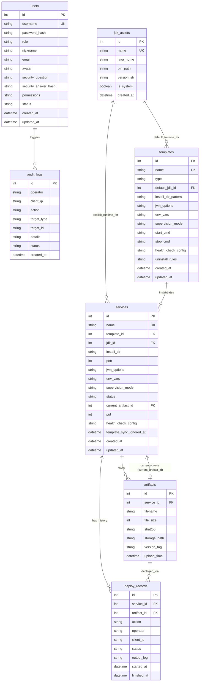

#### ER 关系核心解读：
1. **运行时绑定**：`templates` 可关联一个默认的 `jdk_assets`；而具体创建 `services` 时，可选择沿用模板指定的 JDK，也可显式指定个性化 JDK 资产覆盖。
2. **实例与模板解耦**：`services` 强关联于 `templates`，但自身保留独立的覆盖参数（JVM 参数、环境变量、端口），保证标准化与灵活性并存。
3. **制品闭环引用**：`services` 拥有若干已归档的 `artifacts`；同时 `services` 表通过 `current_artifact_id` 唯一反向锚定当前正在运行生效的制品版本。这一设计保证了制品清理策略能够精确锁定生效包而不误删。
4. **全审计追溯**：`deploy_records` 记录完整的版本发布步骤与控制台输出；`audit_logs` 则记录全局所有变更操作，确保操作人、IP 与动作精确可回溯。

---

### 4.2 数据库表结构全量字典

#### 1. 用户信息表 (`users`)
存放超级管理员与操作员账号、凭据哈希、密保以及原子权限清单。
| 字段名 | 物理类型 | 允许空 | 默认值 | 约束 | 字段用途说明 |
| :--- | :--- | :--- | :--- | :--- | :--- |
| `id` | INTEGER/INT | 否 | 自增 | 主键 | 唯一用户标识 |
| `username` | TEXT/VARCHAR(255) | 否 | 无 | UNIQUE | 登录账号唯一名（>=3字符） |
| `password_hash` | TEXT/VARCHAR(255) | 否 | 无 | 无 | Bcrypt 哈希加密存储的访问密码 |
| `role` | TEXT/VARCHAR(50) | 否 | 'operator' | 无 | 用户主角色：`admin` 或 `operator` |
| `nickname` | TEXT/VARCHAR(255) | 是 | '' | 无 | 界面友好展示的用户昵称 |
| `email` | TEXT/VARCHAR(255) | 是 | '' | 无 | 用户绑定的工作邮箱 |
| `avatar` | TEXT/TEXT | 是 | '' | 无 | 头像图片 URL 或 Base64 编码 |
| `security_question` | TEXT/VARCHAR(512) | 是 | '' | 无 | 找回密码预留的安全密保问题 |
| `security_answer_hash` | TEXT/VARCHAR(255) | 是 | '' | 无 | Bcrypt 哈希加密存储的密保答案 |
| `permissions` | TEXT/TEXT | 是 | '' | 无 | JSON 数组序列化的原子操作权限编码列表 |
| `status` | TEXT/VARCHAR(50) | 否 | 'active' | 无 | 账号状态：`active` (启用) 或 `disabled` (禁用) |
| `created_at` | DATETIME | 否 | 当前时间 | 无 | 账号注册/创建时间 |
| `updated_at` | DATETIME | 否 | 当前时间 | 无 | 账号最后更新时间 |

#### 2. JDK 资产表 (`jdk_assets`)
管理宿主机上已纳管的 Java 运行时资产。
| 字段名 | 物理类型 | 允许空 | 默认值 | 约束 | 字段用途说明 |
| :--- | :--- | :--- | :--- | :--- | :--- |
| `id` | INTEGER/INT | 否 | 自增 | 主键 | JDK 资产主键 |
| `name` | TEXT/VARCHAR(255) | 否 | 无 | UNIQUE | JDK 别名（如 `OpenJDK-21`） |
| `java_home` | TEXT/VARCHAR(512) | 否 | 无 | 无 | 运行时的根目录路径 |
| `bin_path` | TEXT/VARCHAR(512) | 否 | 无 | 无 | 可执行 `bin/java` 的物理绝对路径 |
| `version_str` | TEXT/VARCHAR(255) | 是 | 无 | 无 | 从 `java -version` 提取的真实版本号 |
| `is_system` | BOOLEAN/TINYINT(1)| 否 | 0 | 无 | 是否由自动探测工具发现并登记 |
| `created_at` | DATETIME | 否 | 当前时间 | 无 | 资产录入时间 |

#### 3. 部署模板表 (`templates`)
固化标准化部署规范与调优基线。
| 字段名 | 物理类型 | 允许空 | 默认值 | 约束 | 字段用途说明 |
| :--- | :--- | :--- | :--- | :--- | :--- |
| `id` | INTEGER/INT | 否 | 自增 | 主键 | 模板主键 |
| `name` | TEXT/VARCHAR(255) | 否 | 无 | UNIQUE | 模板名称 |
| `type` | TEXT/VARCHAR(50) | 否 | 无 | 无 | 应用类型：`java_jar` 或 `generic_archive` |
| `default_jdk_id` | INTEGER/INT | 是 | NULL | 外键 | 默认绑定的 JDK 资产 ID |
| `install_dir_pattern` | TEXT/VARCHAR(512) | 否 | 无 | 无 | 安装目录渲染模板（含占位符） |
| `jvm_options` | TEXT/TEXT | 是 | 无 | 无 | 推荐的基础 JVM 堆内存与 GC 参数 |
| `env_vars` | TEXT/TEXT | 是 | 无 | 无 | 默认注入的环境变量字典 |
| `supervision_mode` | TEXT/VARCHAR(50) | 否 | 'native' | 无 | 守护模式：`native` 或 `systemd` |
| `start_cmd` | TEXT/TEXT | 是 | 无 | 无 | 自定义启动渲染命令（可缺省自动拼装） |
| `stop_cmd` | TEXT/TEXT | 是 | 无 | 无 | 自定义停机命令（可缺省使用负 PID 信号） |
| `health_check_config` | TEXT/TEXT | 是 | 无 | 无 | 健康探针 JSON 配置（协议、路径、超时等） |
| `uninstall_rules` | TEXT/TEXT | 是 | 无 | 无 | 卸载与清理行为规范 JSON |
| `created_at` | DATETIME | 否 | 当前时间 | 无 | 创建时间 |
| `updated_at` | DATETIME | 否 | 当前时间 | 无 | 最后调整时间 |

#### 4. 服务实例表 (`services`)
托管的具体进程定义与运行时瞬态记录。
| 字段名 | 物理类型 | 允许空 | 默认值 | 约束 | 字段用途说明 |
| :--- | :--- | :--- | :--- | :--- | :--- |
| `id` | INTEGER/INT | 否 | 自增 | 主键 | 服务主键 |
| `name` | TEXT/VARCHAR(255) | 否 | 无 | UNIQUE | 服务唯一英文标识（如 `order-service`） |
| `template_id` | INTEGER/INT | 否 | 无 | 外键 | 派生此服务的母模板 ID |
| `jdk_id` | INTEGER/INT | 是 | NULL | 外键 | 实例覆盖的 JDK 资产 ID |
| `install_dir` | TEXT/VARCHAR(512) | 否 | 无 | 无 | 宿主机物理安装根目录绝对路径 |
| `port` | INTEGER/INT | 是 | NULL | 无 | 主监听业务端口（用于防冲突与探针） |
| `jvm_options` | TEXT/TEXT | 是 | 无 | 无 | 实例特定覆盖的附加 JVM 选项 |
| `env_vars` | TEXT/TEXT | 是 | 无 | 无 | 实例特定覆盖的环境变量字典 |
| `supervision_mode` | TEXT/VARCHAR(50) | 否 | 'native' | 无 | 实际运行模式：`native` 或 `systemd` |
| `status` | TEXT/VARCHAR(50) | 否 | 'STOPPED'| 无 | 状态枚举：RUNNING, STOPPED, FAILED 等 |
| `current_artifact_id` | INTEGER/INT | 是 | NULL | 外键 | 当前正在运行生效的制品包 ID |
| `pid` | INTEGER/INT | 是 | 0 | 无 | 运行中进程的实际系统 PID |
| `health_check_config` | TEXT/TEXT | 是 | 无 | 无 | 实例特化健康探针规则 |
| `template_sync_ignored_at`| DATETIME | 是 | NULL | 无 | 忽略母模板变更同步的时间戳 |
| `created_at` | DATETIME | 否 | 当前时间 | 无 | 接入创建时间 |
| `updated_at` | DATETIME | 否 | 当前时间 | 无 | 状态与配置最后变动时间 |

#### 5. 制品库表 (`artifacts`)
集中仓库中保存的历史版本归档清单。
| 字段名 | 物理类型 | 允许空 | 默认值 | 约束 | 字段用途说明 |
| :--- | :--- | :--- | :--- | :--- | :--- |
| `id` | INTEGER/INT | 否 | 自增 | 主键 | 制品主键 |
| `service_id` | INTEGER/INT | 否 | 无 | 外键 | 所属服务 ID |
| `filename` | TEXT/VARCHAR(255) | 否 | 无 | 无 | 上传时的原文件名 |
| `file_size` | INTEGER/BIGINT | 否 | 无 | 无 | 文件实际字节大小 |
| `sha256` | TEXT/VARCHAR(64) | 否 | 无 | 无 | 文件的 SHA-256 完整性摘要值 |
| `storage_path` | TEXT/VARCHAR(512) | 否 | 无 | 无 | 集中仓库中持久化落盘的绝对路径 |
| `version_tag` | TEXT/VARCHAR(100) | 否 | 无 | 无 | 易读的版本代号或 Git 标签 |
| `upload_time` | DATETIME | 否 | 当前时间 | 无 | 上传归档时间 |

#### 6. 部署记录表 (`deploy_records`)
记录每次发版流水线的详细执行痕迹与控制台回显。
| 字段名 | 物理类型 | 允许空 | 默认值 | 约束 | 字段用途说明 |
| :--- | :--- | :--- | :--- | :--- | :--- |
| `id` | INTEGER/INT | 否 | 自增 | 主键 | 记录主键 |
| `service_id` | INTEGER/INT | 否 | 无 | 外键 | 目标服务 ID |
| `artifact_id` | INTEGER/INT | 是 | NULL | 外键 | 本次流水线关联的目标制品 ID |
| `action` | TEXT/VARCHAR(50) | 否 | 无 | 无 | 操作动作：`DEPLOY` 或 `ROLLBACK` |
| `operator` | TEXT/VARCHAR(255) | 否 | 无 | 无 | 触发流水线的用户名 |
| `client_ip` | TEXT/VARCHAR(100) | 是 | 无 | 无 | 发起请求的来源 IP |
| `status` | TEXT/VARCHAR(50) | 否 | 无 | 无 | 结果状态：`SUCCESS` 或 `FAILED` |
| `output_log` | TEXT/LONGTEXT | 是 | 无 | 无 | 7 步流水线执行过程中的控制台捕获日志 |
| `started_at` | DATETIME | 否 | 当前时间 | 无 | 流水线触发开始时间 |
| `finished_at` | DATETIME | 是 | NULL | 无 | 流水线完结或中断时间 |

#### 7. 审计日志表 (`audit_logs`)
全平台统一的高危与变更操作审计流水。
| 字段名 | 物理类型 | 允许空 | 默认值 | 约束 | 字段用途说明 |
| :--- | :--- | :--- | :--- | :--- | :--- |
| `id` | INTEGER/INT | 否 | 自增 | 主键 | 审计主键 |
| `operator` | TEXT/VARCHAR(255) | 否 | 无 | 无 | 执行操作的身份账号 |
| `client_ip` | TEXT/VARCHAR(100) | 是 | 无 | 无 | 来源网络 IP 地址 |
| `action` | TEXT/VARCHAR(50) | 否 | 无 | 无 | 标准化动作谓词（START, STOP, CONFIG_EDIT 等） |
| `target_type` | TEXT/VARCHAR(50) | 否 | 无 | 无 | 操作目标类型（service, template, user 等） |
| `target_id` | TEXT/VARCHAR(100) | 否 | 无 | 无 | 被操作目标的主键或唯一标识 |
| `details` | TEXT/TEXT | 是 | 无 | 无 | 变更明细（差异汇总、JSON 入参快照或错误堆栈） |
| `status` | TEXT/VARCHAR(50) | 否 | 无 | 无 | HTTP 执行结果状态（SUCCESS / FAILED） |
| `created_at` | DATETIME | 否 | 当前时间 | 无 | 审计记录生成时间 |

---

## 5. 核心业务流程与实现原理

本节针对系统的 10 大核心业务模块，按照统一格式深入阐述其设计原理、时序与边界处理。

---

### 5.1 认证与权限

#### 1. 这个功能解决什么问题？
保障系统操作的合规性与安全性，防止未授权用户访问高危控制接口，实现超管（Admin）与操作员（Operator）的双层权限隔离，并提供密码遗忘时的线上/线下可靠自救方案。

#### 2. 涉及哪些组件/模块？
- **后端**：`internal/service/auth_service.go`、`internal/service/user_service.go`、`internal/api/middleware/auth.go`、`internal/model/models.go`。
- **前端**：`web/src/components/auth/LoginModal.tsx`、`web/src/hooks/usePermission.ts`、`web/src/components/common/PermissionGate.tsx`。

#### 3. 完整处理流程的文字讲解
- **密码哈希**：用户密码和密保答案在写入数据库前，必须通过具备高强度盐值计算的 Bcrypt 算法派生不可逆哈希，杜绝数据库被盗导致明文泄露。
- **登录鉴权与 Token 签发**：用户提交用户名密码后，服务端校验账号状态是否为有效激活态（禁用态直接阻断）。校验成功后，由后端基于配置中的 JWT 密钥使用 HMAC-SHA256 算法签名生成无状态访问令牌（JWT Token）。Token 内载荷封装用户身份、角色以及当前绑定的权限清单。
- **密保找回流程**：注册时强制填写密保问题与密保答案（同样执行 Bcrypt 哈希存储）。忘记密码时，前端两步调用：第一步通过用户名检索绑定的密保问题；第二步提交密保答案与新密码，后端核对答案哈希一致后重置新口令。
- **权限校验双重防线**：前端通过自定义 Hook 计算是否具备对应权限，无权限时操作按钮自动置灰并展示悬浮 Tooltip 解释；后端路由层通过权限中间件进行正向强校验，若为管理员直接放行，若为操作员则比对权限集合，缺失权限即刻中断并返回 403 错误。

#### 4. 配套时序图
下图展示了用户从登录、获取 Token、发起受限操作至中间件多层鉴权校验的完整时序：

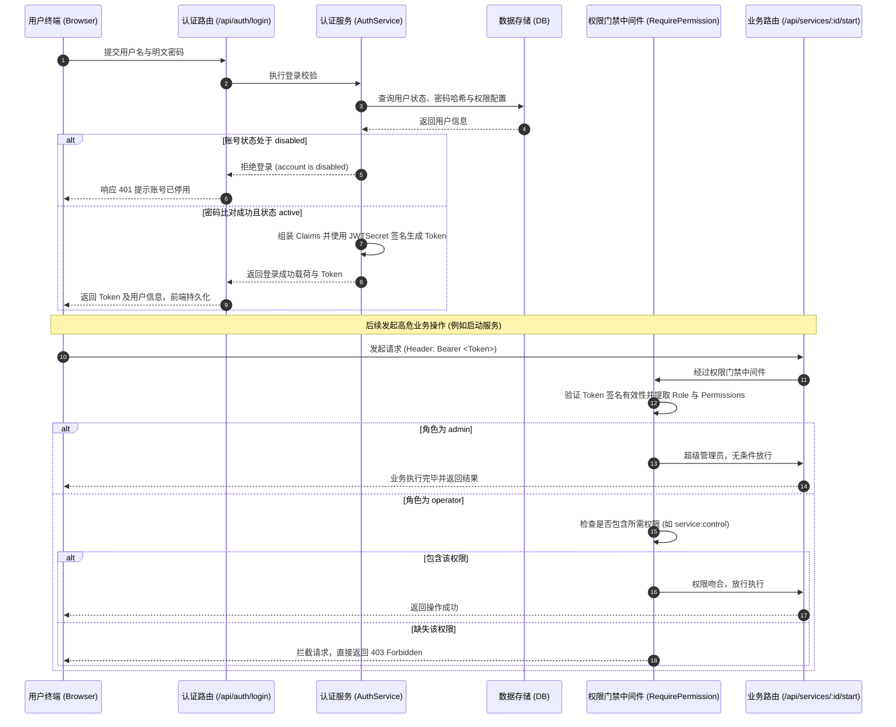

#### 5. 关键设计决策与边界处理
- **防自锁保护机制**：在用户管理服务中，严密拦截对主管理员 `admin` 账号或当前登录人自身的禁用与删除请求，避免出现无法恢复的死锁状态。
- **空权限与未初始化权限严格区分**：对于新创建的操作员，若未配置权限则赋予标准运维默认权限；但若管理员显式清空操作员权限并保存为空数组，系统必须尊重这一撤销意图，不得错误回退为默认权限。
- **离线命令行应急重置**：考虑到可能出现密保遗忘且管理员无法登入的极端情况，系统在命令行中提供 `-reset-password` 启动参数，可在服务器控制台直接离线重设超管密码。

---

### 5.2 审计中间件

#### 1. 这个功能解决什么问题？
对平台内所有具有破坏性、配置变更性或生命周期控制的 HTTP 请求实施非侵入式、自动化、不可抵赖的全局记录，满足企业信息安全等级保护与故障定责要求。

#### 2. 涉及哪些组件/模块？
- **后端**：`internal/api/middleware/audit.go`、`internal/api/handler/audit_handler.go`、`internal/model/models.go`。
- **前端**：`web/src/pages/Audit/AuditList.tsx`。

#### 3. 完整处理流程的文字讲解
- **非侵入式洋葱模型**：审计中间件挂载在全局路由链上。当接收到客户端的变更方法（POST、PUT、DELETE、PATCH）请求时，首先调用链条进入后续业务处理，让领域服务完整执行并渲染响应。
- **后置上下文萃取**：业务执行完毕后，中间件重新捕获控制权。通过检查响应状态码（2xx 判定为成功，4xx/5xx 判定为失败）、业务上下文手动埋点的扩展元数据（动作类型、目标分类、目标主键、差异摘要），以及客户端真实 IP 和操作者身份，拼装出标准化审计实体。
- **异步安全落库与防熔断**：为避免写数据库审计日志阻塞用户的正常响应交互，审计写入由独立的后台任务完成。更关键的是，审计写入采用与当前 HTTP 请求脱钩的带超时独立上下文（利用标准库脱壳机制），即便客户端在操作后立即关闭了浏览器或断网，审计记录依然能够稳妥地写入存储引擎。

#### 4. 配套流程图
下图展示了审计中间件在整个 HTTP 请求生命周期中的环绕与异步脱壳落库机制：

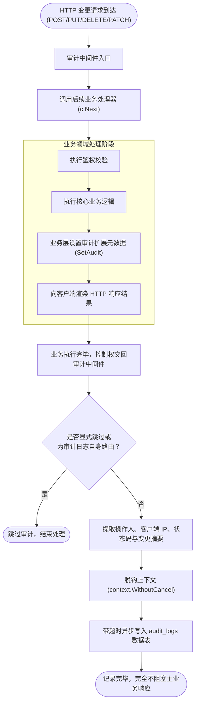

#### 5. 关键设计决策与边界处理
- **递归写入死循环拦截**：审计接口自身（`/api/audit-logs`）的查询或删除操作被中间件强制白名单排除，防止审计操作产生新的审计日志导致系统雪崩。
- **幂等性与脱离生命周期**：利用脱钩上下文保证即使网络发生 RST，操作痕迹依然完整落盘；同时审计日志列表删除功能仅超级管理员可见且可操作，杜绝违规篡改审计流水。

---

### 5.3 JDK 扫描与注册

#### 1. 这个功能解决什么问题？
消除多 Java 版本并存时的路径配置错误，跨平台自动探测服务器现存的 Java 运行时，提取真实版本号与供应商指纹，为模板与服务提供合规可靠的底层运行环境。

#### 2. 涉及哪些组件/模块？
- **后端**：`internal/service/jdk_service.go`、`internal/api/handler/jdk_handler.go`。
- **前端**：`web/src/pages/JDKs/JDKList.tsx`。

#### 3. 完整处理流程的文字讲解
- **跨平台路径探测**：系统运行时自动检测当前操作系统的类别：
  - macOS 环境：扫描系统虚拟机目录及当前环境变量；
  - Linux 环境：遍历常用标准部署根路径（如 `/usr/lib/jvm/`、`/opt/java/`、`/opt/jdk/`）以及当前进程环境变量中的 `$JAVA_HOME`；
  - 递归定位各目录下的 `bin/java` 可执行二进制。
- **版本指纹探测与校验**：对发现的每一个候选可执行文件，系统派生隔离子进程执行获取版本指令。
- **文本流解析**：Java 的版本输出通常打印在标准错误流中，后端采用正则模式匹配提取真实大版本号（如 8、11、17、21）以及供应商信息（如 Temurin、Oracle、OpenJDK）。
- **去重登记与人工注册**：自动扫描所得资产会对比路径去重入库；对于装在非标准路径下的特化运行时，提供手动注册模态窗，并在保存前实时调用探针进行可执行权限预检。

#### 4. 配套流程图
下图展示了跨平台 JDK 探测策略与版本指纹解析流程：

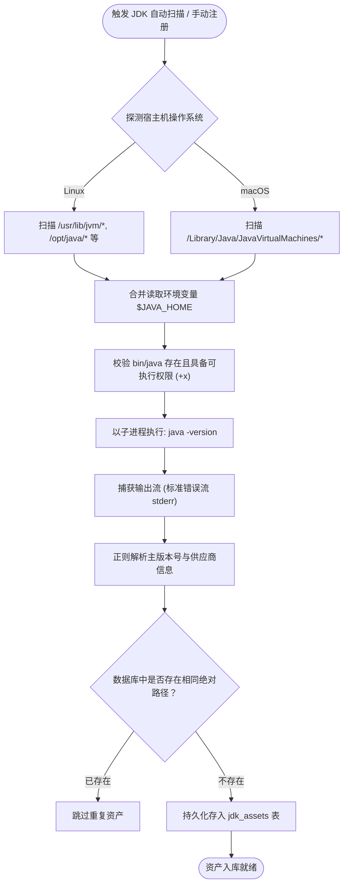

#### 5. 关键设计决策与边界处理
- **删除资产的级联安全防护**：如果某项 JDK 已经被现有的部署模板或正在运行的服务所绑定，系统强行拒绝删除并返回业务冲突错误，防止底层运行时丢失导致进程无法启停。

---

### 5.4 模板引擎

#### 1. 这个功能解决什么问题？
将运维团队沉淀的 JVM 调优参数、目录规范、健康检查与启停脚本沉淀为可复用的标准规范，实现“一处更新、全局受益”，降低微服务治理配置漂移风险。

#### 2. 涉及哪些组件/模块？
- **后端**：`internal/template/engine.go`、`internal/service/template_service.go`。
- **前端**：`web/src/pages/Templates/TemplateEditorModal.tsx`、`web/src/components/service/TemplateSyncModal.tsx`。

#### 3. 完整处理流程的文字讲解
- **宏变量字典插值**：模板启动与停机脚本支持占位符动态替换。渲染引擎在生成真实指令时，自动解析内置保留变量（如服务名称、安装目录绝对路径、制品物理包路径、关联 JDK 执行路径、计算合并后的 JVM 参数串以及运行端口），并将其逐一精准替换。
- **JVM 调优参数可视化合成**：前端通过直观滑块设定堆内存区间（`-Xms` 与 `-Xmx`），选择主流垃圾回收算法（G1, ZGC, Parallel, CMS），由引擎拼装官方最佳实践选项（如 OOM 现场转储、编码参数）。
- **层级继承与合并优先级规则**：
  1. 实例级特化参数（最高优先级，直接覆盖或追加）；
  2. 模板级预设参数（中等优先级，作为基线）；
  3. 系统默认参数（最低优先级，作为安全底线）。
- **母模板变更感知与非侵入式同步**：当管理员修改了母模板定义后，系统不会粗暴强制重启运行中的服务，而是在关联了该模板的服务详情界面显著呈现“发现模板更新”横幅；运维人员可通过差异比对弹窗主动审阅变更并一键确认同步。

#### 4. 配套流程图
下图展示了模板参数从母模板、实例个性化配置到最终启动命令行组装的层级合并过程：

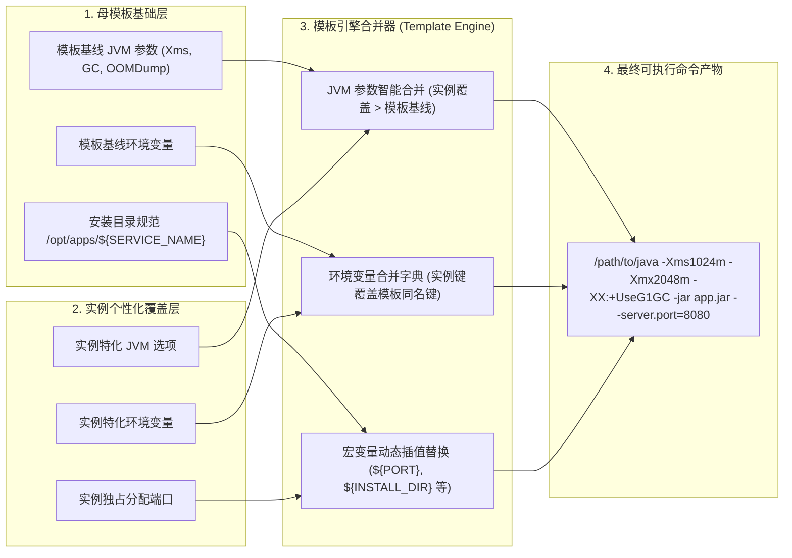

#### 5. 关键设计决策与边界处理
- **应用类型形态自适应**：系统严格区分 `Spring Boot JAR` 与 `通用压缩归档 (Generic Archive)`。当用户创建或切换为通用压缩包类型时，前端和后端渲染引擎自动收起并隐藏 JVM 参数与 Java 运行时配置，转为基于通用启动脚本的生命周期管理。
- **系统保留宏变量防篡改**：防止用户在自定义环境变量中错误覆盖核心关键字段（如注入非法的工作目录占位符），保障生成的指令绝对安全。

---

### 5.5 双模进程守护

#### 1. 这个功能解决什么问题？
在单机环境下实现生产级高可用进程治理，既满足无需 root 权限时的轻量化快速纳管，又兼顾主机标准化运维下利用操作系统级别 Systemd 托管的要求。

#### 2. 涉及哪些组件/模块？
- **后端**：`internal/supervisor/supervisor.go`、`internal/supervisor/native_supervisor.go`、`internal/supervisor/systemd_supervisor.go`。
- **前端**：`web/src/pages/Services/ServiceDetail.tsx`、`web/src/components/service/StatusBadge.tsx`。

#### 3. 完整处理流程的文字讲解
- **原生守护模式 (Native PGID Supervisor)**：
  - **启动隔离**：创建执行命令时，底层显式配置系统调用属性开启全新进程组标识（`Setpgid: true`）。将启动命令重定向输出至对应日志文件，子进程 PID 实时同步持久化至磁盘 `.opshub.pid` 与数据库。
  - **进程重连与自愈**：平台自身重启后，通过探针和系统进程状态检索旧 PID 是否存活，实现无感知接管。
  - **停机信号广播**：停止服务时，系统向负进程组标识（`-PID`）发送优雅退出信号（`SIGTERM`），确保 Java 虚拟机、各类后台守护线程及包装 Shell 脚本全部接收到停机通知。若等待超时（默认 15 秒）进程仍未退出，自动升级为强制杀进程信号（`SIGKILL`），彻底抹杀僵尸进程。
- **Systemd 桥接模式 (Systemd Bridge)**：
  - **单元自动生成**：系统利用服务最新参数在系统服务目录（`/etc/systemd/system/opshub-<service>.service`）动态渲染标准的 Linux 服务单元文件。
  - **代理指令执行**：调用底层系统指令执行服务重载、启动、停止与重启，并通过服务状态查询接口实现与系统服务管理器状态的一致性同步。

#### 4. 配套流程图
下图展示了 Native 模式下使用负 PID 广播与超时强杀保底的退出控制流：

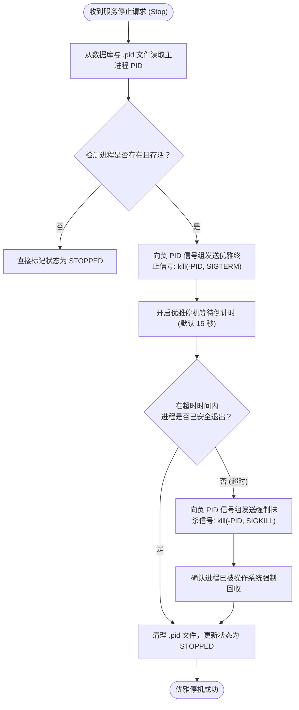

#### 5. 关键设计决策与边界处理
- **孤儿进程广播防护**：系统严格校验 PID 必须大于 1，绝对禁止向非法或根进程 ID 发送负信号，防止误杀操作系统其他核心进程。
- **权限与模式降级提示**：Systemd 模式需要系统级管理员权限。若当前部署环境以普通用户运行且缺少 sudo 权限，系统在界面给出友好阻断提示，并引导用户一键选用 Native 原生守护模式。

---

### 5.6 健康探测器

#### 1. 这个功能解决什么问题？
在服务启动与版本发布过程中精准判定应用是否已真正具备对外提供服务的能力，杜绝“进程虽然拉起但内部初始化异常或端口未就绪”的伪运行状态。

#### 2. 涉及哪些组件/模块？
- **后端**：`internal/prober/prober.go`。
- **前端**：`web/src/pages/Templates/TemplateEditorModal.tsx`。

#### 3. 完整处理流程的文字讲解
系统抽象出统一的探测器接口，支持三种互补的探活协议：
1. **HTTP 业务探活**：通常对接 Spring Boot Actuator 的健康端点（如 `/actuator/health`）。向目标端口与路径发起 HTTP GET 请求，当且仅当收到 HTTP 200 响应（或预设合规状态码）时判定就绪。
2. **TCP 端口探活**：对轻量中间件或未接入 Actuator 的应用，通过建立真实 TCP Socket 握手连接，若端口能够在超时时间内成功连通则判定监听正常。
3. **Process 进程存活探测**：底层利用向 PID 发送存活信号进行内核探测，判定进程是否仍在操作系统调度队列中。
- **重试与超时控制**：探测器具备独立的超时周期与最大重试轮次设计。在服务启动后，探针按固定间隔周期探测，直到成功返回或者超出允许的最大等待时限。

#### 4. 配套流程图
下图展示了多协议健康探测器的判定与状态决断逻辑：

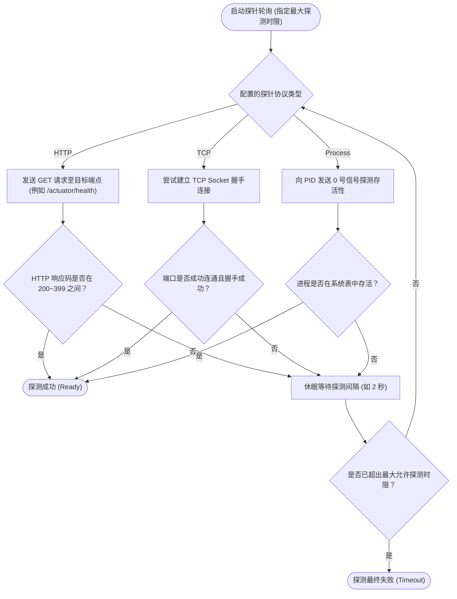

#### 5. 关键设计决策与边界处理
- **短连接防连接泄露**：HTTP 探针强制设置客户端超时与主动关闭连接属性，避免高频探活占满应用连接池。
- **防止进程假死误判**：单纯的进程 PID 存活性检测作为兜底方案，强烈推荐用户配置 HTTP Actuator 或 TCP 端口探针，以真实业务就绪为准。

---

### 5.7 7 步部署流水线与原子回滚状态机

#### 1. 这个功能解决什么问题？
彻底告别传统 Shell 脚本粗暴“停机、直接覆盖、启动不管结果”的高危做法，建立标准化、可观测、带自动回滚能力的原地发版流水线。

#### 2. 涉及哪些组件/模块？
- **后端**：`internal/service/deploy_pipeline.go`、`internal/service/artifact_service.go`、`internal/api/handler/service_handler.go`。
- **前端**：`web/src/components/deploy/DeployWizardModal.tsx`、`web/src/components/deploy/PipelineAnimeProgressBar.tsx`、`web/src/components/deploy/RollbackModal.tsx`。

#### 3. 完整处理流程的文字讲解
流水线严格划分为顺序执行的 7 个原子步骤：
1. **步骤 1：全维预检 (Pre-flight Check)**：校验待发布制品包的物理完整性与 SHA-256 哈希值；检查安装路径读写权限；检查业务端口未被外部非本服务进程占用。
2. **步骤 2：原地备份 (In-place Backup)**：将当前运行工作目录中的旧版本二进制包安全复制至备份目录，保留为 `.prev` 备份。
3. **步骤 3：优雅停机 (Graceful Stop)**：向运行中的旧实例发送停机信号，轮询等待其完全释放端口。
4. **步骤 4：制品分发与覆盖 (Distribute & Overwrite)**：从集中制品仓库将目标版本包解压或拷贝覆盖至工作目录。
5. **步骤 5：启动新版 (Launch Instance)**：组装最新 JVM 参数与环境变量，派生拉起新版本进程，标记为启动中。
6. **步骤 6：就绪探测与决断 (Readiness Probe)**：调用健康探测器持续探活。
   - **分支 A（成功）**：健康探测在规定时间内返回成功，进入步骤 7。
   - **分支 B（失败/超时）**：触发自动回滚逻辑。立即停掉异常新进程，将备份目录中的旧版本包逆向还原至工作目录，拉起旧版本并恢复旧版运行，将本次发布记录标记为失败，并保留旧生效版本不变。
7. **步骤 7：记录生效 (Finalize)**：将数据库中该服务的生效制品标识（`current_artifact_id`）正式更新为新制品 ID，写入部署流水记录，打上发布成功标印。

#### 4. 配套时序图
下图完整刻画了 7 步发版流水线以及在步骤 6 遇到探测失败时自动执行逆向自愈回滚的完整时序：

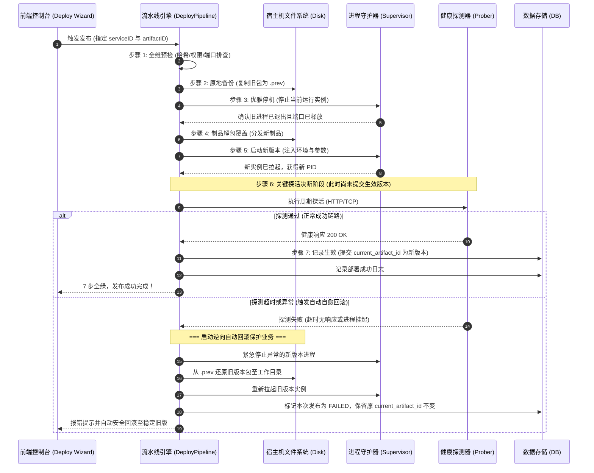

#### 5. 关键设计决策与边界处理
- **延迟生效原则**：严禁在步骤 4 或 5 过早更新数据库的 `current_artifact_id`。必须等步骤 6 彻底就绪后才提交事务，保证系统任意时刻发生断电或崩溃，元数据与物理事实严格对齐。
- **一键原子回滚**：历史版本列表中提供的一键回滚，实质上是将指定历史制品作为源，重新驱动该 7 步状态机，保证回滚动作同样享有备份和就绪检测保护。

---

### 5.8 制品管理与保留策略

#### 1. 这个功能解决什么问题？
在保障磁盘空间不被历史无限制上传的构建包撑爆的前提下，建立自动化的历史版本归档与淘汰清理机制，同时绝对保护生产当前正在运行的制品安全。

#### 2. 涉及哪些组件/模块？
- **后端**：`internal/service/artifact_service.go`、`internal/api/handler/service_handler.go`。
- **前端**：`web/src/pages/Services/ServiceDetail.tsx`。

#### 3. 完整处理流程的文字讲解
- **集中制品仓库归档**：用户上传或构建推送的每个制品包，统一按服务标识命名空间归档于数据根目录的集中制品库中，记录其原始文件名、字节尺寸与上传时间戳。
- **客户端与服务端双重 SHA-256 计算**：客户端在上传前通过 Web Worker 流式计算散列值；服务端在流式接收落盘时同步计算散列值，比对一致方可纳管。
- **配额保留策略执行 (Retention Enforce)**：系统支持设定每个服务允许保留的历史制品最大数量（如保留最近 5 个版本）。发版完成后自动触发清理评估，按时间倒序找出超出阈值的淘汰候选列表。
- **当前生效版本的保护逻辑**：在遍历删除淘汰候选包之前，系统强制查询服务主表中当前生效的制品主键（`current_artifact_id`）。**若淘汰候选包恰好等于当前生效制品，系统强制跳过删除**，从而杜绝由于长期未发版导致线上正在运行的代码包被轮转机制误删。

#### 4. 配套流程图
下图展示了在执行制品保留上限清理时，如何识别并绝对豁免当前生效版本：

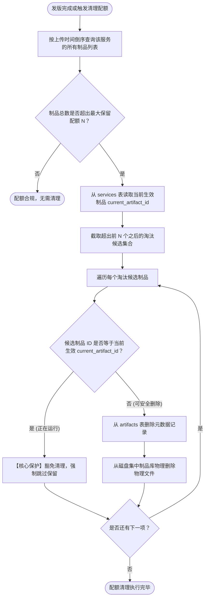

#### 5. 关键设计决策与边界处理
- **删除在用制品的主动阻断**：操作员若在界面手动点击删除某个历史制品，如果该制品正好是当前生效运行的版本，删除接口直接抛出业务冲突异常（`ErrArtifactInUse`）并拒绝操作。

---

### 5.9 日志实时推送

#### 1. 这个功能解决什么问题？
解决生产环境下控制台日志动辄数 GB 导致传统 Web 界面拉取卡死、大内存暴涨的痛点；提供大文件秒开、实时追踪、动态暂停以及文件被轮转截断时的自愈恢复能力。

#### 2. 涉及哪些组件/模块？
- **后端**：`internal/tailer/tailer.go`、`internal/api/websocket/hub.go`。
- **前端**：`web/src/components/terminal/LiveLogViewer.tsx`。

#### 3. 完整处理流程的文字讲解
- **大文件逆向寻址 (Reverse Seek)**：
  - 客户端连接建立时，支持请求末尾 N 行（默认 200 行，上限 5000 行）。
  - 后端绝对不从头线性读取大文件。而是获取当前文件物理尺寸后，将读指针直接 Seek 移动到文件尾部向前截取指定字节窗口（内存上限硬保护 8MB），逆向扫描换行符快速定位起始字节偏移，首屏数据毫秒级回显。
- **文件截断自愈机制 (Truncation Handling)**：
  - 在持续轮询跟随新写入内容时，系统定期获取文件描述符大小。
  - 若检测到文件当前物理大小小于上一轮读取时的尺寸（说明运维执行了清空日志操作），系统自动将读指针重置回文件起始偏移 0，平滑继续读取。
- **文件轮转自愈机制 (Log Rotation Handling)**：
  - 当外部组件（如 Linux logrotate）触发日志轮转重命名旧文件并新建同名日志时，当前打开的文件描述符 inode 会与磁盘上的新文件不一致。
  - Tailer 每次轮询校验文件状态，一旦检测到文件已被替换，自动安全关闭旧文件描述符，重新打开新生成的物理文件，无缝续接日志流。

#### 4. 配套时序图
下图展示了 WebSocket 建立握手、大日志逆向 Seek 首屏推送与长连接持续增量推流的完整过程：

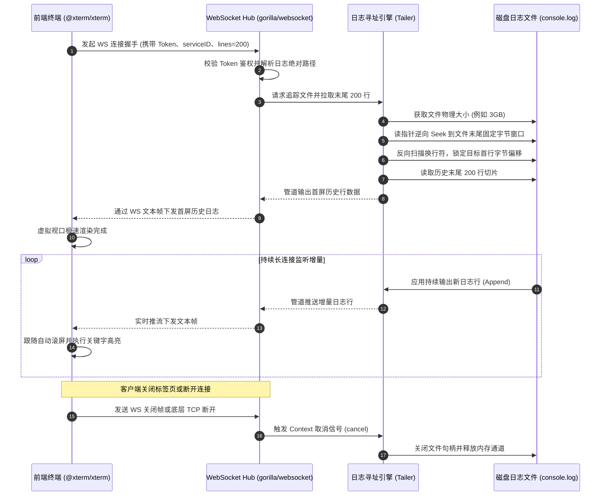

#### 5. 关键设计决策与边界处理
- **反向寻址边界对齐**：若逆向寻址窗口穷尽时恰好切在某行文本的中间，引擎会自动向前顺移到下一个完整换行符，杜绝向前端推送乱码残缺行。
- **客户端断开即时销毁**：通过独立的协程监听 WebSocket 的底层读泵，一旦捕获到连接断开信号，立即关闭文件句柄并释放管道协程，防止服务端产生资源泄漏。

---

### 5.10 在线配置差异对比与原子快照

#### 1. 这个功能解决什么问题？
提供不依赖外部配置中心的单机配置在线管理能力；直观展示每次改动的增删差异，防止误改误删核心参数，并在物理落盘前提供自动快照回退能力。

#### 2. 涉及哪些组件/模块？
- **后端**：`internal/api/handler/service_handler.go`。
- **前端**：`web/src/components/config/ConfigDiffEditor.tsx`。

#### 3. 完整处理流程的文字讲解
- **配置探测与加载**：根据服务安装目录，自动扫描探测常见的应用配置文件（如 `application.yml`、`application.properties`、`config.yaml` 等），以文本形式加载至编辑缓冲区。
- **LCS 差异算法渲染**：前端内置基于“最长公共子序列 (Longest Common Subsequence)”的轻量差异比对引擎，支持将原有配置与当前草稿进行行级别的双向比对。支持在“双栏并排 (Side-by-Side)”与“单列合并 (Inline)”两种模式间自由切换，新增行以浅绿高亮标记，删除行以浅红高亮标记。
- **自动快照物理备份**：在用户点击提交并确认变更统计后，后端接收新内容。在正式用新内容覆写原文件之前，**系统强制在同目录下生成带精准时间戳的物理备份文件**（例如 `application.yml.bak.20260917-194500`）。
- **原子覆写与重启提示**：新配置写入磁盘后，接口返回成功，前端界面常驻提示“配置已写入磁盘，请重启服务以使配置生效”。

#### 4. 配套流程图
下图展示了在线配置从探测、编辑、LCS 差异渲染到时间戳快照原子保存的全链路：

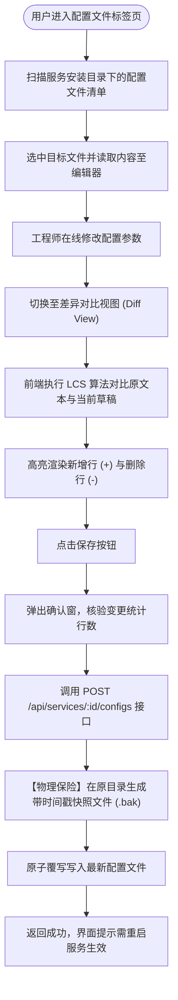

#### 5. 关键设计决策与边界处理
- **路径遍历安全防御**：严格校验请求中传入的文件名必须为基准纯文件名，严禁包含包含相对路径跳转符号（如 `../`），防止恶意越权读取或覆盖操作系统根目录的关键系统文件。

---

## 6. RESTful API 接口规范

平台所有受保护的 RESTful 接口均必须在 HTTP 请求头部携带标准令牌：`Authorization: Bearer <JWT_TOKEN>`。各模块接口元数据清单如下：

### 6.1 认证与个人中心接口

| 接口方法 | 相对路径 | 鉴权要求 | 请求参数要素说明 | 响应结构核心字段 | 业务状态码说明 |
| :--- | :--- | :--- | :--- | :--- | :--- |
| `POST` | `/api/auth/login` | 公开接口 | 用户名 (`username`)、密码 (`password`) | 令牌 (`token`)、用户信息对象 (`user`) | 200 成功，401 凭据错误或账号停用 |
| `POST` | `/api/auth/register` | 公开接口 | 账号、密码、密保问题、密保答案、昵称、邮箱 | 注册结果状态、直接签发的访问令牌 | 200 成功，400 参数格式不合规或已存在 |
| `GET` | `/api/auth/security-question` | 公开接口 | 查询参数：目标账号 (`username`) | 预留的密保问题文本 (`security_question`) | 200 成功，404 未设置密保或用户不存在 |
| `POST` | `/api/auth/reset-password` | 公开接口 | 账号、密保答案、新设密码 (`new_password`) | 密码重置成功状态信息 | 200 成功，400 密保核验失败或密码过短 |
| `GET` | `/api/auth/me` | 需携带 Token | 无 | 包含角色与权限清单的完整用户资料 | 200 成功，401 凭据失效 |
| `PUT` | `/api/auth/profile` | 需携带 Token | 昵称 (`nickname`)、邮箱 (`email`)、头像数据 | 更新后的个人信息实体 | 200 成功，400 格式错误 |
| `POST` | `/api/auth/change-password`| 需携带 Token | 旧密码 (`old_password`)、新密码 (`new_password`) | 修改成功确认信息 | 200 成功，400 旧密码核验错误 |

---

### 6.2 用户治理与权限管理接口 (仅超级管理员)

| 接口方法 | 相对路径 | 权限要求 | 请求参数要素说明 | 响应结构核心字段 | 业务状态码说明 |
| :--- | :--- | :--- | :--- | :--- | :--- |
| `GET` | `/api/users` | 需 Admin 角色 | 分页与搜索关键词 (`keyword`) | 用户实体列表（含角色、状态、权限数） | 200 成功，403 权限不足 |
| `POST` | `/api/users` | 需 Admin 角色 | 用户名、初始密码、角色、初始权限清单 | 新建成功的用户实体 | 201 成功，400 用户名重复 |
| `PUT` | `/api/users/:id/permissions`| 需 Admin 角色 | 显式权限编码数组 (`permissions`) | 权限更新生效确认 | 200 成功，404 用户不存在 |
| `PUT` | `/api/users/:id/status` | 需 Admin 角色 | 目标状态 (`active` / `disabled`) | 状态更新结果（受防自锁保护） | 200 成功，400 尝试停用超管 |
| `POST` | `/api/users/:id/reset-password`|需 Admin 角色 | 重置的新密码字符串 | 重置成功状态 | 200 成功，404 用户不存在 |
| `DELETE`| `/api/users/:id` | 需 Admin 角色 | 路径参数：用户主键 ID | 删除成功确认（受防自锁保护） | 200 成功，400 尝试删除超管 |

---

### 6.3 JDK 资产管理接口

| 接口方法 | 相对路径 | 权限要求 | 请求参数要素说明 | 响应结构核心字段 | 业务状态码说明 |
| :--- | :--- | :--- | :--- | :--- | :--- |
| `GET` | `/api/jdks` | Token 即可 | 无 | 已注册的 JDK 实体列表（版本、路径） | 200 成功 |
| `POST` | `/api/jdks` | `jdk:manage` | 自定义名称 (`name`)、Java 绝对路径 (`bin_path`)| 预检通过并入库的 JDK 实体 | 201 成功，400 路径非法不可执行 |
| `GET` | `/api/jdks/scan` | `jdk:manage` | 无 | 自动探测并新入库的 JDK 列表与计数 | 200 成功 |
| `DELETE`| `/api/jdks/:id` | `jdk:manage` | 路径参数：JDK 资产 ID | 删除成功确认 | 200 成功，409 已被服务或模板绑定 |

---

### 6.4 部署模板管理接口

| 接口方法 | 相对路径 | 权限要求 | 请求参数要素说明 | 响应结构核心字段 | 业务状态码说明 |
| :--- | :--- | :--- | :--- | :--- | :--- |
| `GET` | `/api/templates` | Token 即可 | 无 | 模板全量列表（含基础信息与调优参数）| 200 成功 |
| `POST` | `/api/templates` | `template:manage` | 模板名称、类型、JVM 选项、目录规则、探针规则 | 新建完成的模板实体对象 | 201 成功，400 模板名称冲突 |
| `PUT` | `/api/templates/:id` | `template:manage` | 需更新的调优参数、环境字典与守护模式 | 更新生效后的模板对象 | 200 成功，404 模板不存在 |
| `DELETE`| `/api/templates/:id` | `template:manage` | 路径参数：模板 ID | 删除成功确认 | 200 成功，409 已有服务实例化该模板 |

---

### 6.5 服务舰队管理接口

| 接口方法 | 相对路径 | 权限要求 | 请求参数要素说明 | 响应结构核心字段 | 业务状态码说明 |
| :--- | :--- | :--- | :--- | :--- | :--- |
| `GET` | `/api/services` | Token 即可 | 过滤关键词、状态筛选 | 服务概要列表（含当前状态、PID、端口）| 200 成功 |
| `POST` | `/api/services` | `service:manage` | 关联模板 ID、服务唯一名称、端口、安装目录 | 创建成功的服务实体 | 201 成功，400 端口或名称冲突 |
| `GET` | `/api/services/:id` | Token 即可 | 路径参数：服务主键 ID | 包含配置、当前包、探针状态的详细信息 | 200 成功，404 服务不存在 |
| `PUT` | `/api/services/:id` | `service:manage` | 实例特化的 JVM 参数、端口修改、环境变量 | 更新后的服务详细配置 | 200 成功 |
| `POST` | `/api/services/:id/start` | `service:control` | 无 | 异步启动指令受理确认与状态流转 | 200 成功，409 实例已在运行中 |
| `POST` | `/api/services/:id/stop` | `service:control` | 无 | 优雅停机指令受理确认 | 200 成功，409 实例未处于运行态 |
| `POST` | `/api/services/:id/restart`|`service:control` | 无 | 原子重启指令受理确认 | 200 成功 |
| `DELETE`| `/api/services/:id` | `service:manage` | 路径参数：服务主键 ID | 实例注销与卸载结果 | 200 成功，409 运行中服务禁止删除 |

---

### 6.6 制品发布与配置编辑接口

| 接口方法 | 相对路径 | 权限要求 | 请求参数要素说明 | 响应结构核心字段 | 业务状态码说明 |
| :--- | :--- | :--- | :--- | :--- | :--- |
| `POST` | `/api/services/:id/artifacts` | `service:deploy` | 表单上传二进制文件 (`file`)、版本标签 | 归档后的制品实体（含 SHA-256 与路径）| 201 成功，400 校验和不匹配 |
| `POST` | `/api/services/:id/deploy` | `service:deploy` | 目标制品 ID (`artifact_id`) | 7 步流水线启动状态与执行记录 ID | 200 成功，504 探测超时回滚 |
| `POST` | `/api/services/:id/rollback` | `service:rollback` | 目标回滚历史制品 ID | 回滚流水线执行结果与确认信息 | 200 成功 |
| `GET` | `/api/services/:id/configs` | `service:config` | 无 | 可用配置文件名清单及默认文件内容 | 200 成功 |
| `POST` | `/api/services/:id/configs` | `service:config` | 目标文件名 (`filename`)、最新文本内容 | 保存成功状态及自动生成的 `.bak` 快照名 | 200 成功，400 路径非法 |
| `GET` | `/api/services/:id/logs/download`| Token 即可 | 目标日志文件名 (`file`) | 对应日志文件的二进制字节流（附件下载）| 200 成功，404 文件不存在 |

---

### 6.7 审计日志与系统监控接口

| 接口方法 | 相对路径 | 权限要求 | 请求参数要素说明 | 响应结构核心字段 | 业务状态码说明 |
| :--- | :--- | :--- | :--- | :--- | :--- |
| `GET` | `/api/audit-logs` | `audit:view` | 操作人、动作类型、目标类型、分页参数 | 审计流水实体分页列表及总计数 | 200 成功，403 权限不足 |
| `DELETE`| `/api/audit-logs/:id` | 需 Admin 角色 | 路径参数：审计流水 ID | 单条流水删除确认 | 200 成功，403 仅管理员可删 |
| `GET` | `/api/system/metrics` | Token 即可 | 无 | 宿主机 CPU、内存物理占用、磁盘余量 | 200 成功 |
| `GET` | `/api/system/health` | 公开端点 | 无 | 平台自身运行健康心跳指示 | 200 成功 |

---

## 7. WebSocket 实时通讯协议规范

系统提供高性能实时双向日志推送流，用于替代低效轮询。

### 7.1 握手连接与鉴权规范
- **连接端点格式**：`ws://<HOST>:<PORT>/api/services/:id/logs/ws`
- **鉴权传输方式**：
  由于浏览器原生 WebSocket API 无法在建立握手时自定义设置 HTTP 标头，系统采用 **URL 查询参数传递机制**：
  在握手连接末尾追加 `?token=<JWT_TOKEN>`。后端的认证拦截中间件自动提取并核验该查询参数中的有效性，鉴权失败立即以 HTTP 401 阻断握手协议升级。
- **可选查询参数**：
  | 参数名 | 类型 | 缺省默认值 | 约束与语义 |
  | :--- | :--- | :--- | :--- |
  | `token` | 字符串 | 必填 | 有效的用户身份 JWT 签名令牌 |
  | `lines` 或 `tail`| 整数 | 200 | 首屏初始反向 Seek 提取的末尾行数，上限不可超过 5000 行 |
  | `file` | 字符串 | `console.log` | 拟追踪的日志文件名（仅限工作目录下纯文件名，防路径穿越） |

### 7.2 消息传输格式与语义
- **通讯数据帧格式**：纯文本数据帧（`WebSocket.TextMessage`）。
- **服务端下发语义**：
  - **首屏切片阶段**：建立连接成功瞬间，后端将逆向扫描定位出的历史末尾行，按原先的时间顺序逐行下发。
  - **实时增量推流阶段**：被纳管服务只要向标准输出或日志文件追加新行，Tailer 立即捕获换行并通过文本帧推流下发，每条文本帧承载一行纯文本日志（尾部自动去除换行符）。
- **心跳与断开检测**：
  - 服务端开启独立的读协程，持续监听来自前端的心跳与关闭帧；
  - 一旦客户端关闭窗口或网络失联，读泵立即触发当前 Context 的取消信号，关闭后端文件描述符并回收连接通道。

---

## 8. 本地开发与构建打包流程

### 8.1 本地开发环境准备
- **Go 编译工具链**：Go 1.22 及以上版本；
- **前端工具链**：Node.js 18+，npm 9+；
- **构建驱动工具**：GNU Make；
- **操作系统建议**：Linux、macOS 或配置有 WSL2 的 Windows 开发机。

### 8.2 双端独立调试运行方式
1. **启动后端开发服务**：
   - 进入项目根目录；
   - 执行 Go 包依赖拉取指令同步第三方库；
   - 首次运行可在本地直接以源码方式运行主入口，默认将在本地启动服务并监听 8080 端口，自动在本地家目录下初始化数据仓库。
2. **启动前端热更新服务**：
   - 打开新终端，进入 `web/` 子目录；
   - 执行依赖安装指令同步前端包；
   - 运行前端开发构建指令（启动 Vite 本地开发服务器）；
   - Vite 默认开启本地代理配置，自动将前端发起的 `/api` 请求与 WebSocket 握手反向代理至后端的 8080 端口，实现双端独立热重载调试。

### 8.3 生产单二进制一体化打包
通过项目根目录下的自动化构建规范（Makefile），执行一键集成打包：
1. **自动化阶段 1（前端构建）**：
   Makefile 自动进入 `web/` 目录执行生产编译指令，生成深度摇树优化并经过 Gzip 压缩的前端单页面产物，输出至 `web/dist/` 目录。
2. **自动化阶段 2（静态内嵌与后端编译）**：
   Go 编译器通过根目录下的静态资源嵌入声明文件，将 `web/dist/` 内的所有静态资源文件完整打包压缩并映射为 Go 符号表。
3. **自动化阶段 3（全静态去 CGO 编译）**：
   后端以关闭 CGO 模式（`CGO_ENABLED=0`）执行构建，并剥离符号表与调试信息以极致压缩体积。
4. **最终产物交付**：
   在项目的 `bin/` 目录下生成唯一的独立可执行文件 `bin/opshub`（大小约 30MB 左右）。该文件已自包含所有前后端资产，直接复制到任何无安装环境的目标服务器上即可稳定运行。

---

## 9. 质量保证与自动化测试策略

平台构建了全方位、多层次的自动化质量守护闭环，覆盖后端单元测试、领域集成测试以及前端组件与界面交互测试。

### 9.1 后端自动化测试体系
- **数据层与隔离测试**：
  针对纯 Go 模式的 SQLite 数据库驱动建立独立的内存模式和临时文件测试，验证 DDL 迁移、双库驱动切换以及增量迁移脚本的幂等性。
- **进程守护集成测试**：
  在原生守护模式测试用例中，真实派生测试守护脚本，验证负 PID 信号树是否能彻底杀灭多级派生子进程，并测试超时强杀逻辑。
- **流水线全覆盖测试**：
  模拟成功发版、探针正常返回、启动闪退异常以及健康检查超时等全场景，确保自动逆向回滚的严谨性与元数据的一致性。
- **执行命令与验证**：通过在项目根目录下执行标准 Go 测试指令（如测试全部包），确保所有业务包测试通过率达到 100%。

### 9.2 前端组件与交互测试体系
- **测试框架栈**：基于 Vitest 测试驱动平台，搭配 React Testing Library 模拟真实用户界面交互。
- **鉴权与路由守卫测试**：
  针对 `usePermission` 自定义 Hook 和 `PermissionGate` 门禁组件建立用例，分别模拟超管与各类受限操作员身份，验证按钮置灰提示与界面元素展现逻辑。
- **核心组件行为测试**：
  覆盖登录弹窗、7 步发版向导、实时日志终端、配置差异对比编辑器以及用户管理授权列表，全量验证在不同交互和主题下的渲染正确性。
- **执行命令与验证**：在 `web/` 目录下执行针对全部测试套件的无头单次运行指令，保证 30+ 测试文件及 220+ 前端测试用例保持 100% 绿灯通过。

---

## 10. 已知系统限制与未来演进方向

### 10.1 已知系统限制
1. **单物理机纳管边界**：
   当前架构定位为聚焦于“单机轻量化极致运维”，所有进程守护、目录操作与探针探活均作用于当前 OpsHub 运行的所在服务器上，暂未引入跨多节点的分布式调度编排机制。
2. **本地文件依赖**：
   集中制品库默认存储在当前主机的物理磁盘上。若部署在临时无持久化盘的云主机上，主机销毁后归档制品需依赖用户自行对数据目录实施物理快照备份。
3. **并发发版保护**：
   针对同一个服务实例，流水线禁止并发多次发版；当某服务正在执行发版流水线时，其他发版请求将被锁保护机制拒绝。

### 10.2 后续可扩展与演进方向
1. **多节点 Agent / 分布式纳管架构**：
   保留当前单二进制的核心能力，在架构上解耦“控制面 (Control Plane)”与“边缘代理 (Node Agent)”，支持在多个目标机器部署精简版 Agent，由主控制台统一纳管多机舰队。
2. **制品对象存储对接 (S3 / OSS)**：
   在现有集中制品库接口之上，扩展抽象外部存储后端驱动，支持将历史构建产物自动转储至兼容 S3 协议的分布式对象存储中。
3. **告警通知通道集成**：
   在健康探测失败触发回滚或服务异常崩溃时，通过 Webhook 渠道自动对接企业微信、钉钉机器人或飞书群告警，提升故障感知的即时性。

---

## 11. 附录

### 11.1 架构术语表

| 专业术语 | 英文对照 | 核心技术定义 |
| :--- | :--- | :--- |
| **原地部署** | In-Place Deployment | 应用程序直接在宿主机既定绝对目录下完成解压、覆盖与拉起的轻量发布方式，不经过容器层虚拟化封装。 |
| **进程组隔离** | Process Group (PGID) | POSIX 操作系统提供的多进程管理抽象。通过为进程树赋予独立的负 PID 标识，实现信号的全组无缝广播与彻底回收。 |
| **无状态令牌** | Stateless JWT | 采用密钥签名、载荷自包含的身份票据，服务端无需使用 Redis 等集中缓存保存会话状态，极大降低单机系统复杂度。 |
| **就绪探针** | Readiness Probe | 在实例启动后、正式接收外部业务流量之前，由平台发起的持续性端口或 HTTP 探活行为，用于证实应用内部完全初始化完毕。 |
| **最长公共子序列** | LCS Algorithm | 一种动态规划算法，用于精确比对两份配置文件的差异变动行，是版本对比 Diff 编辑器的底层数学核心。 |
| **逆向寻址** | Reverse Seek | 大文件按字节偏移量反向向前搜寻换行符的技术，使得多 GB 的大日志文件无需全量加载进内存即可毫秒级展现尾部内容。 |

---

### 11.2 版本变更记录

| 架构迭代版本 | 变更时间 | 核心特性与架构升级 |
| :--- | :--- | :--- |
| **v1.0.0** | 2026-09-09 | 平台核心骨架确立；支持单二进制构建与 `embed.FS` 资源内嵌；实现 Native 进程组守护与 7 步基础发布流水线。 |
| **v1.1.0** | 2026-09-11 | 引入 WebSocket 实时日志推流中心与 xterm.js 虚拟终端集成；上线配置在线 LCS 差异对比编辑器与自动快照保护。 |
| **v1.2.0** | 2026-09-13 | 数据库引擎解耦，升级为兼容 SQLite (无 CGO) 与 MySQL 8.0+ 双引擎；上线制品配额与生效制品保护机制。 |
| **v1.3.0** | 2026-09-15 | 架构级接入 RBAC 权限控制体系；新增用户治理页面、防自锁保护、密保找回流程与按钮级细粒度门禁阻断。 |
| **v1.4.0** | 2026-09-17 | 全链路接入多套高质量视觉主题风格（战术光棱、战术暗夜、木紫茶岩）；升级流水线动漫吉祥物自适应进度条；完成全系统自动化回归。 |

---

*OpsHub 架构体系 — 追求极致工程效率与高可靠守护。*

