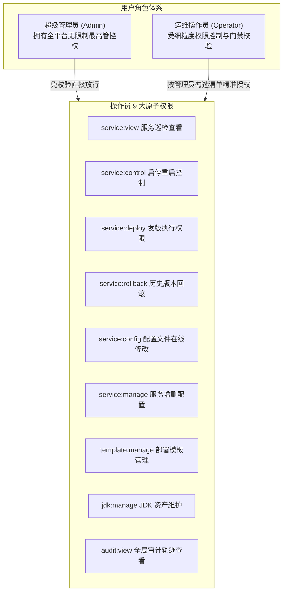

# OpsHub 运维发布平台用户使用手册

<div align="center">

**轻量级单机应用运维与部署控制台**  
面向运维人员与研发工程师的操作指南

</div>

---

## 目录

1. [软件简介](#1-软件简介)
2. [环境要求与安装部署](#2-环境要求与安装部署)
   - [2.1 运行环境要求](#21-运行环境要求)
   - [2.2 安装部署方式](#22-安装部署方式)
   - [2.3 配置文件与环境变量](#23-配置文件与环境变量)
   - [2.4 首次启动与初始密码获取](#24-首次启动与初始密码获取)
3. [登录与账号管理](#3-登录与账号管理)
   - [3.1 用户登录](#31-用户登录)
   - [3.2 账号注册与密保设置](#32-账号注册与密保设置)
   - [3.3 找回密码（密保自救与管理员重置）](#33-找回密码密保自救与管理员重置)
   - [3.4 修改密码与个人资料](#34-修改密码与个人资料)
   - [3.5 角色与权限体系说明 (RBAC)](#35-角色与权限体系说明-rbac)
4. [功能模块操作指南](#4-功能模块操作指南)
   - [4.1 概览看板与系统指标](#41-概览看板与系统指标)
   - [4.2 JDK 资产管理](#42-jdk-资产管理)
   - [4.3 部署模板管理](#43-部署模板管理)
   - [4.4 服务舰队管理](#44-服务舰队管理)
   - [4.5 版本发布与回滚](#45-版本发布与回滚)
   - [4.6 实时日志查看](#46-实时日志查看)
   - [4.7 配置文件在线编辑与差异对比](#47-配置文件在线编辑与差异对比)
   - [4.8 审计日志查询](#48-审计日志查询)
5. [常见问题与故障排查](#5-常见问题与故障排查)
   - [5.1 端口占用问题](#51-端口占用问题)
   - [5.2 健康检查超时导致发布自动回滚](#52-健康检查超时导致发布自动回滚)
   - [5.3 权限不足与按钮置灰](#53-权限不足与按钮置灰)
   - [5.4 忘记登录密码](#54-忘记登录密码)
   - [5.5 进程启动失败与闪退排查](#55-进程启动失败与闪退排查)
6. [附录](#6-附录)
   - [6.1 术语表](#61-术语表)
   - [6.2 常见错误码与报错对照表](#62-常见错误码与报错对照表)

---

## 1. 软件简介

**OpsHub** 是一款专为 Java 应用（如 Spring Boot 系列微服务）以及通用中间件设计的现代化轻量级单机运维与发布平台。平台采用单一静态二进制文件交付，无需安装外部 Web 服务器或预装重量级容器环境，即可为运维人员和研发工程师提供从 **JDK 资产纳管**、**标准化模板制定**、**服务进程生命周期托管**、**7 步原地高可用版本发布与秒级自动回滚**，到 **超大日志实时秒开推流**、**配置在线差异比对（Diff）** 与 **全链路审计追踪** 的一站式可视化管控体验。

---

## 2. 环境要求与安装部署

### 2.1 运行环境要求

#### 目标服务器（运行 OpsHub 的机器）
- **操作系统**：Linux（主流发行版如 Ubuntu 18.04+、CentOS 7+、Debian 10+、Rocky Linux 等）或 macOS。
- **架构**：x86_64 (amd64) 或 ARM64。
- **内存与磁盘**：
  - 内存：基础运行仅需 64MB 可用内存；
  - 磁盘：建议保留 2GB 以上空闲空间（用于存储 SQLite 数据库、上传的制品包归档及日志快照）。
- **基础依赖**：系统自带基础工具集（`sh`、`tar`、`ps` 等命令）。
- **权限建议**：以普通非 root 用户即可正常运行 Native 进程守护模式；若需由操作系统级 `systemd` 统一接管服务，则需要服务器的 `sudo` 或 `root` 权限。

#### 编译机器（仅从源码自建时需要）
- Go 1.22 或更高版本
- Node.js 18+ 与 npm 9+
- Make 工具环境

---

### 2.2 安装部署方式

OpsHub 提供「直接运行二进制」与「源码编译打包」两种部署方式。推荐直接使用编译完成的单二进制包。

#### 方式一：直接运行二进制包（推荐）

1. **下载可执行文件**：从发布渠道获取对应系统架构的 `opshub` 单一可执行程序，并上传至目标服务器目录（例如 `/opt/opshub/`）。
2. **授予执行权限**：
   ```bash
   chmod +x opshub
   ```
3. **启动平台**：
   ```bash
   ./opshub
   ```

#### 方式二：从源码编译打包

若您拥有项目完整源码，可一键将前端交互界面与后端服务编译压制为一个自包含的单一可执行文件：

1. **克隆代码库并进入目录**：
   ```bash
   git clone https://github.com/xiaotang2024/OpsHub.git
   cd OpsHub
   ```
2. **一键构建生产产物**：
   ```bash
   make build-all
   ```
   *构建过程中 Makefile 会自动构建 `web/` 前端生产代码，并通过 Go 静态内嵌机制打包至后端二进制文件中。*
3. **获取输出产物**：
   构建完成后，产物位于根目录 `bin/opshub`（文件大小约 30MB），可独立复制到任意服务器直接运行：
   ```bash
   ls -lh bin/opshub
   ./bin/opshub
   ```

---

### 2.3 配置文件与环境变量

OpsHub 遵循“开箱即用、零配置启动”原则，默认内置安全合理的参数。如需自定义端口或切换外部 MySQL 数据库，可通过 `config.yaml` 配置文件进行调配。

#### 配置文件探测顺序
启动时系统按以下优先级自动加载配置文件：
1. 启动命令行通过 `-config` 指定的路径（如 `./opshub -config /etc/opshub/config.yaml`）；
2. 当前目录下的 `./config.yaml`；
3. 当前目录子路径 `./config/config.yaml`；
4. 若以上文件均不存在，系统将自动回退使用内置默认配置。

#### `config.yaml` 完整配置示例：
```yaml
# HTTP 服务监听与安全配置
server:
  port: 8080                                      # Web 界面与 API 访问端口
  jwt_secret: "opshub-jwt-secret-replace-me"      # 生产环境请替换为自定义高强度字符串

# 数据持久化存储主目录（自动在本地创建）
data_dir: "~/.opshub/data"

# 数据存储引擎配置
database:
  driver: "sqlite"                                # 选项："sqlite"（默认）或 "mysql"
  # dsn 留空时，SQLite 自动存放在 data_dir 下的 opshub.db
  # dsn: ""

  # 若使用 MySQL（版本需 >= 8.0，且已预先建库，提供建表与读写权限）：
  # driver: "mysql"
  # dsn: "opshub_user:your_password@tcp(127.0.0.1:3306)/opshub?charset=utf8mb4&parseTime=True"
```

#### 核心目录结构说明
| 目录/文件 | 默认相对路径 | 用途说明 |
| :--- | :--- | :--- |
| `opshub.db` | `~/.opshub/data/opshub.db` | 嵌入式 SQLite 数据库，保存所有资产、模板、服务及审计记录 |
| `packages/` | `~/.opshub/data/packages/` | 制品仓库归档库，集中存放历史上传与部署的 `.jar` / `.tar.gz` 包 |
| `logs/` | `~/.opshub/data/logs/` | 平台自身运行日志存储目录 |

---

### 2.4 首次启动与初始密码获取

首次在服务器上启动 OpsHub 时，系统若检测到用户表为空，将自动初始化超管账户 `admin` 并生成高强度随机初始口令。

#### 启动控制台输出示例：
```text
==================================================================
                   OPSHUB INITIAL SETUP
==================================================================
  A default administrator account has been generated:
    Username: admin
    Password: [ T8k!m9Q2xL7zP4vW ]
  Please store this password safely and change it immediately.
==================================================================
[OpsHub] Starting HTTP server on :8080
```

> **[此处插入首次启动终端输出初始密码截图]**

> [!IMPORTANT]
> - 控制台高亮框中的密码仅在首次启动时打印一次。
> - 请立即复制保存，并在首次登录后进入平台个人中心修改密码。
> - 若不慎关闭终端未记录密码，请参阅后文 [5.4 忘记登录密码](#54-忘记登录密码) 通过命令行一键重置。

---

## 3. 登录与账号管理

### 3.1 用户登录

1. 使用主流现代浏览器（Chrome、Edge、Safari、Firefox）访问：`http://<服务器IP>:8080`。
2. 若当前未持有有效认证凭据，系统将自动弹出 **OpsHub 控制台登录** 对话框。
3. 录入登录信息：
   - **用户名**：初始为 `admin`（或已注册的操作员用户名）；
   - **登录密码**：输入控制台打印的初始口令或自定义密码。
4. 点击 **“确认登录”** 按钮。登录成功后系统会自动在浏览器安全保存登录凭据，并平滑加载控制台主界面。

> **[此处插入系统登录界面截图]**

---

### 3.2 账号注册与密保设置

平台支持新成员自主注册账号。为保障后续遗忘密码时能安全自助找回，注册流程强制集成密保安全验证机制。

1. 在登录窗口底部点击 **“注册新账号 (Create Account)”** 切换至注册面板。
2. 按要求填写注册信息表单：
   - **登录账号 (Username)**：至少 3 个字符，仅支持英文字母、数字与下划线；
   - **显示昵称 (Nickname)**：选填，日常在界面展示的用户友好称谓；
   - **工作邮箱 (Email)**：选填，便于接收运维通知；
   - **访问密码 (Password)**：至少 6 位，支持组合密码；
   - **确认密码 (Confirm Password)**：再次输入以防止误输入；
   - **密保安全问题**：支持在预设问题中选择（如“您就读的第一所小学名称？”、“您出生或长大的城市名称？”等），亦可选择“自定义密保问题...”输入个性化问题；
   - **密保安全答案**：输入该安全问题的准确答案（系统已做加密存储）。
3. 点击 **“完成注册并进入”** 按钮。注册成功后系统将自动签发权限并登入系统。

> **[此处插入用户注册与密保设置界面截图]**

---

### 3.3 找回密码（密保自救与管理员重置）

当用户遗忘访问口令时，系统提供“线上密保自助重置”与“线下超管重置”双通道。

#### 方式一：线上密保自助重置
1. 在登录弹窗下方点击 **“忘记密码？(Forgot Password)”** 链接。
2. **步骤 1：查询密保**：输入需要找回口令的用户名，点击“查询密保问题”。系统将调出注册时预置的问题。
3. **步骤 2：重置密码**：
   - 输入您预留的密保答案；
   - 输入新的访问密码（至少 6 位）及确认密码；
   - 点击 **“确认重置并登录”** 按钮。验证成功后密码立即生效，系统将引导使用新密码重新登录。

> **[此处插入找回密码密保验证界面截图]**

#### 方式二：超级管理员后台/离线重置
- 若用户未设置密保或遗忘密保答案，超级管理员可登录控制台，进入「用户管理」页面，在对应用户右侧点击 **“重置密码”** 直接为其下发新密码。
- 若超级管理员自身遗忘密码，请参考 [5.4 忘记登录密码](#54-忘记登录密码) 在服务器终端执行重置指令。

---

### 3.4 修改密码与个人资料

1. 登录系统后，点击左侧导航栏底部的用户头像或昵称，唤出 **“个人资料与设置 (Profile & Settings)”** 弹窗。
2. **修改资料**：
   - 在「基础资料」标签页下，可修改中文昵称、工作邮箱；
   - 点击头像区域可从预设极客头像库中挑选心仪图标，或点击“本地上传”更新自定义个人头像（图片不超过 2MB）；
   - 点击右下方 **“保存资料修改”** 提交。
3. **修改密码**：
   - 切换到「安全与密码」标签页；
   - 依次输入 **“当前使用旧密码”**、**“设置全新密码”**（至少 6 位）以及 **“再次确认新密码”**；
   - 点击 **“更新登录密码”**。更新成功后即刻生效。

> **[此处插入个人资料与修改密码界面截图]**

---

### 3.5 角色与权限体系说明 (RBAC)

OpsHub 采用企业级双层 RBAC（基于角色的访问控制）架构，将系统成员明确划分为两类角色：



#### 超级管理员专属权限
- **用户管理面板 (`/users`)**：仅管理员可见，用于创建用户、分配权限、停用/激活账号、重置密码与删除离职人员。
- **审计日志清除**：审计日志列表与服务轨迹中的删除功能仅限管理员操作，操作员界面完全隐藏删除入口。
- **防自锁安全底线**：系统严禁任何用户（包括超管自己）禁用或删除主 `admin` 账号或当前正在登录的自身账号。

#### 操作员一键预设权限模板
管理员在为运维操作员配置权限时，可直接点击 3 大常用标准化模板一键套用：
1. **【标准运维（默认）】**：包含服务查看、启停控制、版本发版、一键回滚、配置修改、审计查看；适用于绝大多数日常业务运维同学。
2. **【只读巡检】**：仅包含服务查看与审计查看权限，所有修改、发版与控制操作全部禁用；适用于开发定位、测试排查或外包巡检角色。
3. **【全功能运维】**：勾选全部 9 项权限，开放服务增删、模板调整及 JDK 注册管理能力。

---

## 4. 功能模块操作指南

### 4.1 概览看板与系统指标

#### 入口位置
点击左侧主导航栏顶部的 **“概览看板 (Dashboard)”**。

> **[此处插入概览看板与系统指标界面截图]**

#### 操作步骤
1. 打开概览页面，首先查阅顶部 **“系统资源实时监控面板”**（涵盖 CPU 综合利用率、物理内存实际占用与宿主机主分区磁盘余量）。
2. 查看右侧 **“服务舰队统计指标”**，获取当前托管服务的总数、运行中实例数、异常停止数等全局健康水位。
3. 查看顶部状态栏的 **“健康心跳指示器 (Status Beacon)”**，确认 Web 客户端与 OpsHub 后端服务通道处于毫秒级畅通状态。
4. **多主题个性化切换**：
   - 点击顶部右上角的 **“主题调色盘”** 按钮；
   - 在弹出的主题菜单中随心选择：
     - **极客暗夜 (Cyber Slate)**：经典深空灰蓝背景搭配高亮荧光青蓝，适合暗光与长时间巡检；
     - **战术光棱 (Tactical Light)**：高对比极昼浅白背景搭配沉稳普鲁士青蓝，适合明亮办公环境与投影汇报；
     - **木紫茶岩 (Wood & Terracotta)**：深木紫卡片搭配赤茶陶土配色，沉稳古雅。
   - 选择后系统瞬间平滑过渡切换，并持久保存至本地。

#### 参数/字段说明
| 指标项 | 展示形态 | 业务含义 | 阈值告警参考 |
| :--- | :--- | :--- | :--- |
| **CPU 利用率** | 仪表进度条 + 百分比 | 宿主机整体 CPU 使用水位 | 持续 > 85% 需关注宿主机负载 |
| **内存占用** | 已用量 / 总量 (GB) | 物理内存消耗比例 | 建议保留 15% 以上系统空闲内存 |
| **磁盘剩余** | 环形图 + 剩余 GB | `/` 或数据存储盘可用空间 | 低于 10GB 需及时清理历史日志或旧包 |
| **实例状态** | 运行/停止/异常数字徽章 | 当前服务器上托管进程的实时分布 | 存在异常实例需进入排查 |

#### 操作结果
能够对整机负载、运行水位与平台自身连接状态建立全局直观认知，及时预警资源枯竭隐患。

#### 注意事项
- 系统监控指标每隔固定周期自动刷新拉取，无需频繁手动按 F5 刷新网页。

---

### 4.2 JDK 资产管理

#### 入口位置
点击左侧主导航栏的 **“JDK 资产 (JDK Assets)”**。

> **[此处插入JDK资产管理列表与注册弹窗截图]**

#### 操作步骤
1. **自动扫描本地已有 JDK**：
   - 点击页面右上方的 **“扫描系统 JDK (Auto-Scan)”** 按钮；
   - 系统将立即自动扫描服务器标准路径（如 Linux 下 `/usr/lib/jvm/`、`/opt/java/`、macOS 下 `/Library/Java/JavaVirtualMachines/` 以及当前环境变量 `$JAVA_HOME`）；
   - 扫描完毕后，系统自动提取版本（如 OpenJDK 8、11、17、21）与供应商信息，并高亮呈现在资产表格中。
2. **手动精准登记 JDK**：
   - 若 Java 安装在个性化自定义路径，点击 **“登记 JDK (Register)”** 按钮唤起弹窗；
   - 录入资产名称与 `bin/java` 的绝对路径；
   - 点击 **“确认保存”**，系统后台会自动校验该路径是否具有可执行权限并解析对应版本，通过后入库生效。
3. **注销/删除无效 JDK**：
   - 在资产列表中找到已卸载或废弃的 JDK 记录，点击右侧的 **“删除”** 按钮；
   - 在二次确认弹窗中确认删除。

#### 参数/字段说明
| 字段名称 | 必填 | 示例值 | 说明 |
| :--- | :--- | :--- | :--- |
| **JDK 名称** | 是 | `Oracle-JDK-17-LTS` | 便于在服务配置时识别的别名 |
| **Java 路径** | 是 | `/opt/jdk-17.0.2/bin/java` | 必须指向可执行的 `java` 文件绝对路径 |
| **版本号** | 自动 | `17.0.2` | 系统执行 `java -version` 提取所得 |
| **供应商** | 自动 | `Eclipse Adoptium` / `Oracle` | 系统底层指纹探测识别 |

#### 操作结果
为后续创建 Java 应用模板或针对单个服务指定运行时提供标准化的可信执行环境映射。

#### 注意事项
- 无法删除已被现有服务或部署模板所绑定的 JDK 资产；若确需移除，须先将相关模板或服务的运行时切换为其他 JDK。
- 操作员需具备 `jdk:manage` 权限才可使用扫描、登记与删除功能；无权限时按钮将显示锁止提示。

---

### 4.3 部署模板管理

#### 入口位置
点击左侧主导航栏的 **“部署模板 (Templates)”**。

> **[此处插入部署模板工作室与JVM调优滑块截图]**

#### 操作步骤
1. **新建模板**：
   - 点击右上角的 **“新建模板 (Create Template)”** 按钮打开编辑弹窗。
2. **填写基本架构信息**：
   - 录入模板标识名称（如 `Spring-Boot-标准微服务`）；
   - 选择应用类型：
     - **`Spring Boot JAR`**：标准 Java 应用，开放 JVM 专属调优器；
     - **`通用压缩归档 (Generic Archive)`**：如 Tomcat、Nginx、Go 二进制或含自定义启动脚本的 `.tar.gz`，自动收起并隐藏 JVM 相关选项。
   - 设定默认运行时 JDK（针对 Java 模板）；
   - 设定默认安装目录规范，支持变量如 `/opt/apps/${SERVICE_NAME}`；
   - 选择进程守护模式：**Native（原生进程组）** 或 **Systemd（系统服务）**。
3. **可视化配置 JVM 调优参数（仅 Java 模板）**：
   - 拖动滑块直观指定 **堆内存初始值 (`-Xms`)** 与 **堆内存最大值 (`-Xmx`)**（单位支持 MB / GB）；
   - 单击选择垃圾回收器（**G1GC**、**ZGC**、**ParallelGC**、**CMS**），系统自动合成官方推荐参数；
   - 勾选 `-XX:+HeapDumpOnOutOfMemoryError` 确保 OOM 时保留转储现场；
   - 右侧控制台实时呈现最终拼装完成的完整参数串，支持一键点击复制。
4. **配置健康检查探针**：
   - 探测协议类型：选择 `HTTP`、`TCP` 或 `PROCESS`；
   - 探测路径：若选择 HTTP，通常设为 Spring Boot Actuator 端点（如 `/actuator/health`）；
   - 探测间隔与超时：设置如探测间隔 `5` 秒，单次超时 `3` 秒。
5. **保存与编辑/删除**：
   - 点击 **“确认保存”** 归档模板；
   - 模板列表支持随时点击 **“编辑”** 调优参数；当模板参数变更时，关联了该模板的服务详情页会自动显示“发现模板更新”横幅，提示一键同步；
   - 对不再使用的模板可点击 **“删除”**（若已有服务关联则禁止直接删除）。

#### 参数/字段说明
| 参数分类 | 字段标识 | 推荐/默认值 | 作用说明 |
| :--- | :--- | :--- | :--- |
| **基础信息** | `name` | `spring-boot-prod` | 模板唯一标识 |
| | `type` | `java_jar` | 模板类型（`java_jar` / `generic_archive`） |
| | `install_dir_pattern`| `/opt/apps/${SERVICE_NAME}` | 实例部署的标准化根目录模式 |
| | `supervision_mode` | `native` | 守护方式：`native` (轻量进程组) / `systemd` (系统单元) |
| **JVM 调优** | `heapMin` / `heapMax`| `512MB` / `1024MB` | 堆内存范围 `-Xms` / `-Xmx` |
| | `gcStrategy` | `G1` | GC 算法：G1, ZGC, Parallel, CMS |
| **健康探针** | `healthType` | `http` | 探活方式：`http`, `tcp`, `process` |
| | `healthPath` | `/actuator/health` | HTTP 健康检查 URI |
| | `healthInterval` | `5` (秒) | 探活周期 |

#### 操作结果
固化企业级标准化发布规范，服务只需绑定该模板即可自动继承优化的 JVM 参数与健康检查准则。

#### 注意事项
- 在自定义启动命令中，可使用 `${JAVA_BIN}`、`${PORT}`、`${INSTALL_DIR}`、`${PACKAGE_FILE}`、`${JVM_OPTIONS}` 等标准动态占位符。
- 操作员需具备 `template:manage` 权限方可维护模板资产。

---

### 4.4 服务舰队管理

#### 入口位置
点击左侧主导航栏的 **“服务舰队 (Service Fleet)”**。

> **[此处插入服务舰队卡片列表截图]**

#### 操作步骤
1. **新建接入服务**：
   - 点击右上角 **“新建服务 (Create Service)”** 按钮；
   - 选择所依赖的 **“部署模板”**（系统自动带出该模板的最佳实践配置）；
   - 输入 **服务唯一标识**（如 `order-service`）；
   - 指定分配给该实例的 **运行监听端口**（如 `8081`）；
   - 系统将依据模板规则自动计算出安装路径（如 `/opt/apps/order-service`），亦可手动按需微调；
   - 点击 **“确认创建”**，服务卡片即刻挂载至舰队矩阵中。
2. **日常启停与重启运维**：
   - 在目标服务卡片上，直观展示当前状态徽章（绿色脉冲代表 `RUNNING`，红色暗点代表 `STOPPED`，猩红闪烁代表 `FAILED`）；
   - 点击 **“启动 (Start)”**：系统调用进程守护引擎派生独立进程组，界面伴随流光动画与即时状态切换；
   - 点击 **“停止 (Stop)”**：向对应进程树发送 `SIGTERM` 优雅停机信号，超时未退出时自动升级安全兜底；
   - 点击 **“重启 (Restart)”**：原子化执行重启并等待健康就绪。
3. **查看深度详情与修改配置**：
   - 点击卡片空白处或 **“详情”** 按钮，即可打开右侧抽屉或跳转至 **服务详情全屏控制台 (`/services/:id`)**；
   - 详情页内可查阅进程实际 PID、CPU / 物理内存实时折线、持续在线时长（Uptime Ticker）；
   - 点击服务名称旁的编辑图标，可在线调整服务监听端口或基础信息。

#### 参数/字段说明
| 字段名称 | 示例值 | 约束与说明 |
| :--- | :--- | :--- |
| **服务名称** | `trade-gateway` | 服务唯一英文标识，用作进程标识与目录识别 |
| **关联模板** | `Spring-Boot-标准微服务` | 决定了该服务继承的 JVM 选项与启停指令 |
| **服务端口** | `8080` | 必须为宿主机未被占用的 TCP 端口 |
| **安装目录** | `/opt/apps/trade-gateway` | 制品解包覆盖与配置存放的绝对物理路径 |

#### 操作结果
服务成功入驻控制台，状态实时可控，随时可进行版本发布与实时巡检。

#### 注意事项
- 若需修改端口，请确保修改后的端口在目标服务器上未被其他进程占用。
- 服务启停受 `service:control` 权限门禁保护；新建或修改服务受 `service:manage` 权限控制。

---

### 4.5 版本发布与回滚

#### 入口位置
进入目标服务的 **服务详情页 (`/services/:id`)**，切换至 **“版本与发布 (Releases)”** 标签页。

> **[此处插入7步发布流水线与回滚弹窗截图]**

#### 操作步骤

##### 场景 A：发布新版本制品
1. 在版本与发布页面点击 **“部署新版本 (Deploy New Version)”** 按钮，弹出 7 步部署向导弹窗。
2. **选择待发布的制品文件**：
   - **方式 1：上传新制品包**：将本地打包好的 `.jar` 或 `.tar.gz` 文件拖拽至上传区域（或点击选择文件）。上传过程中客户端会自动计算 SHA-256 校验和并展示进度条，确保传输完整无篡改；可填入版本备注标签（如 `v2.4.1` 或 `git-commit-8f3a`）；
   - **方式 2：选用历史已有制品**：从下方的历史已上传仓库制品库中直接点选目标包。
3. **点击“开始执行 7 步部署”**：
   - 界面启动高科技动漫风流水线进度条与跑动吉祥物进度反馈；
   - 流水线依次自动化推进 7 个关键阶段：
     1. **全维预检 (Pre-flight)**：校验制品完整度与路径安全性；
     2. **原地备份 (In-place Backup)**：将运行中的旧版文件备份为 `.bak` 快照；
     3. **优雅停机 (Graceful Stop)**：向旧进程发送退出信号并确认端口释放；
     4. **制品分发 (Extract & Overwrite)**：解压并覆盖新制品至安装根目录；
     5. **拉起新版 (Launch Instance)**：以既定 JVM 参数与端口拉起新进程；
     6. **就绪探测 (Readiness Probe)**：持续对健康接口或端口探活，等待业务健康返回；
     7. **记录生效 (Finalize)**：健康探测通过，正式提交发布记录并打上 `CURRENT` 生效标印。
   - 界面支持展开“实时流水线控制台日志”，实时追踪发布过程细节。
4. 部署完成后，点击“完成并返回”，服务即以新版本在线稳定运行。

##### 场景 B：一键秒级原子回滚
1. 当新版本发生未知业务缺陷或故障时，打开 **“版本与发布”** 历史发布轴。
2. 找到任意过往健康成功的历史版本卡片，点击右侧的 **“一键回滚 (Rollback)”** 按钮。
3. 弹出回滚确认框，界面清晰比对 **“当前故障版本”** 与 **“目标回滚版本”** 的文件名称、SHA-256 哈希值、发布人与时间戳。
4. 点击 **“确认执行秒级回滚”**。平台后台自动从归档制品库调用历史制品，执行停机换包与恢复启动，全自动秒级恢复业务。

#### 参数/字段说明
| 阶段/要素 | 关键数据项 | 作用 |
| :--- | :--- | :--- |
| **上传阶段** | SHA-256 Checksum | 客户端实时计算，杜绝网络传输损耗或恶意劫持破坏 |
| | 版本标识 (Version Tag) | 易读业务标签，如 `v1.2.0-hotfix` |
| **流水线状态** | `SUCCESS` | 7 步全绿，健康探测返回 200，版本正式生效 |
| | `FAILED` | 就绪探测超时或启动异常，**系统已自动回退旧版并恢复运行** |

#### 操作结果
发布流程标准化可追溯，故障发生时能够无视人为失误在几秒内一键撤回至任意稳定旧版。

#### 注意事项
- **安全防线**：在步骤 6 就绪探测成功之前，旧版本生效状态不会被覆写；若探测失败，流水线会自动执行逆向自愈回滚，最大程度保障业务连续性。
- 发布操作需持有 `service:deploy` 权限；回滚操作需持有 `service:rollback` 权限。

---

### 4.6 实时日志查看

#### 入口位置
进入目标服务的 **服务详情页 (`/services/:id`)**，切换至 **“实时日志 (Live Logs)”** 标签页。

> **[此处插入xterm.js实时日志终端与搜索截图]**

#### 操作步骤
1. **秒级打开大日志**：
   - 切换到该标签页后，系统基于底层逆向指针寻址，瞬间加载日志末尾最新内容并建立长连接实时推流（即使宿主机日志达数 GB 也绝不卡顿浏览器）。
2. **关键词检索与高亮定位**：
   - 在日志控制台顶部的搜索框中输入关键字（如 `ERROR`、`NullPointerException` 或交易流水号）；
   - 终端内即时高亮匹配词条，并显示匹配总数（如 `7 matches for "ERROR"`）；
   - 使用前后切换箭头按钮即可在海量日志间上下穿梭定位。
3. **控制推流与视图锁定**：
   - **自动滚动锁定 (Auto-Scroll Lock)**：点击锁图标，可选择是否固定视角跟随最新尾部日志跳动；向上滚轮翻阅历史时自动解除跟随；
   - **暂停/恢复推流 (Pause/Resume)**：点击“暂停”按钮即可冻结终端屏幕，此时后端日志暂存至内存环形缓冲区，再次点击“恢复”时平滑补发。
4. **日志导出与清理**：
   - 点击 **“清屏 (Clear)”** 可清理当前终端展示区内容；
   - 点击 **“下载完整日志 (Download)”** 即可直接将服务器上的全量日志文本文件保存到本地进行离线归档分析。

#### 参数/字段说明
| 控制按钮 | 快捷状态 | 作用说明 |
| :--- | :--- | :--- |
| **搜索框** | 实时输入 | 毫秒级前端高亮与结果定位匹配 |
| **跟随锁定** | 开启 / 关闭 | 开启时有新日志自动滑到最底；关闭时自由翻阅历史 |
| **推流开关** | 播放 / 暂停 | 暂停终端流输出，避免高速日志冲刷视线 |
| **导出下载** | 直接触发 | 调用安全接口将服务端日志文件流式打包下载 |

#### 操作结果
运维与研发人员无需登录服务器 SSH 黑屏终端，即可在浏览器内获得堪比本地终端的高性能查日志排障体验。

#### 注意事项
- 日志文件默认读取该服务工作目录下输出的日志内容；请确保服务产生日志后具有读取权限。

---

### 4.7 配置文件在线编辑与差异对比

#### 入口位置
进入目标服务的 **服务详情页 (`/services/:id`)**，切换至 **“配置文件 (Configuration)”** 标签页。

> **[此处插入配置文件LCS差异对比编辑器截图]**

#### 操作步骤
1. **选择配置文件**：
   - 在编辑区上方的文件下拉选择框中，选定需要编辑的目标配置文件（如 `application.yml`、`application.properties` 等）。
2. **在线编辑与语法呈现**：
   - 在左侧主编辑框中直接对配置项（如数据库连接池、日志级别、三方接口地址）进行修改；
   - 编辑器支持精准行号联动与代码语法高亮。
3. **查看变更差异对比 (Diff)**：
   - 点击右上角切换至 **“差异对比 (Diff View)”** 模式；
   - 可在 **“双栏并排对比 (Side-by-Side)”** 与 **“单列合并对比 (Inline Unified)”** 之间自由切换；
   - 界面以高对比色清晰标注：深浅绿色（`+`）为本次新增行，深浅红色（`-`）为本次删除/修改前的内容。
4. **提交保存与备份生效**：
   - 点击 **“保存修改”** 按钮，系统会弹出确认弹窗，并精确汇总当前变更量（例如：`+3 行新增，-1 行删除`）；
   - 点击确认保存后，系统在物理覆盖前，**会自动在服务端同目录下生成带时间戳的备份文件**（例如 `application.yml.20260917-183000.bak`），确保误改可快速还原；
   - 界面显著常驻提示：“修改已成功写入磁盘，请重启服务以使配置生效”。

#### 参数/字段说明
| 界面元素 | 功能表现 | 作用说明 |
| :--- | :--- | :--- |
| **文件下拉框** | 文件名列表 | 识别并切换服务安装目录下的可编辑配置清单 |
| **差异标注 (+/-)**| 绿色高亮 / 红色高亮 | 直观审核所有变动的行，杜绝意外增减参数 |
| **自动备份 (.bak)** | 服务端自动快照 | 防范误操作的物理保险丝 |

#### 操作结果
配置变更透明可见、有据可查、自带自动快照备份，规避因误改配置引发的非预期线上事故。

#### 注意事项
- 配置文件修改保存后仅更新磁盘文件，**必须手动重启服务方可使新配置在应用内存中生效**。
- 操作员需具备 `service:config` 权限才可保存修改配置。

---

### 4.8 审计日志查询

#### 入口位置
点击左侧主导航栏的 **“审计日志 (Audit Logs)”**，或在服务详情页下查看 **“审计轨迹 (Audit Trail)”**。

> **[此处插入审计日志多维检索列表截图]**

#### 操作步骤
1. **多维度过滤检索**：
   - **操作人员**：输入特定账号筛选该人员的历史行为（如 `admin` 或指定操作员）；
   - **操作动作**：在下拉框中指定高危动作（`START`、`STOP`、`RESTART`、`DEPLOY`、`ROLLBACK`、`CONFIG_UPDATE`、`USER_CREATE` 等）；
   - **目标分类**：选择针对 `service`（服务）、`template`（模板）、`jdk`（JDK资产）或 `user`（用户）的变更；
   - 点击 **“搜索 / 刷新”** 即可分页调出匹配的流水。
2. **查阅审计详情**：
   - 在表格中查阅每笔操作的关键要素（时间、操作人、动作、目标、来源客户端 IP、执行响应状态码及概要描述）；
   - 点击行右侧的 **“查看详情”** 按钮，弹出操作上下文弹窗，查阅完整的入参 JSON 或差异详情快照。
3. **清理审计日志（仅管理员）**：
   - 若当前登录者为超级管理员 `admin`，在行末尾将展示“删除”操作按钮；
   - 点击后确认即可物理剔除冗余或合规归档后的记录；普通操作员角色不会显示该操作列。

#### 参数/字段说明
| 字段名称 | 示例数据 | 说明 |
| :--- | :--- | :--- |
| **时间 (Timestamp)** | `2026-09-17 18:24:06` | 操作发生的精确服务端时区时间 |
| **操作人 (Operator)**| `admin` / `op_zhangsan` | 触发该变更的账号身份 |
| **动作 (Action)** | `DEPLOY` / `CONFIG_UPDATE` | 标准化操作谓词 |
| **操作对象 (Target)**| `service #10 (order-service)` | 关联的具体资源类型与唯一标识 |
| **客户端 IP** | `192.168.1.108` | 发起网络请求的客户端来源 IP 地址 |
| **状态码 (Status)** | `200 OK` (绿) / `500 ERR` (红) | 执行结果状态 |

#### 操作结果
全平台所有破坏性或变更性动作不可抵赖、责任可溯，全流程符合企业安全合规要求。

#### 注意事项
- 审计记录由平台全局非阻塞拦截器独立异步落库，即使客户端中途关闭浏览器，操作记录依然会如实记入数据库。
- 普通操作员需具备 `audit:view` 权限方可查阅审计日志。

---

## 5. 常见问题与故障排查

### 5.1 端口占用问题

- **常见现象**：启动或重启服务时，界面弹出错误提示 `bind: address already in use` 或 `Port 8080 is already occupied`。
- **排查步骤**：
  1. 登录目标服务器终端，执行命令查询占用端口的进程信息：
     ```bash
     # 以端口 8080 为例
     lsof -i :8080
     # 或使用 netstat
     netstat -tlpn | grep :8080
     ```
  2. 确认占用端口的是否为外部残留进程、非托管服务或同类服务。
- **解决方式**：
  - **方案 A**：若占用进程为废弃残留，在终端通过 `kill -9 <PID>` 终止该进程，释放端口；
  - **方案 B**：若该端口已被其他重要系统服务占用，进入 OpsHub 该服务的配置详情，将运行端口修改为其他空闲端口（如 `8088`），保存后重新启动。

---

### 5.2 健康检查超时导致发布自动回滚

- **常见现象**：在 7 步发版流水线中，前面 5 步正常推进，但在“步骤 6 就绪探测”处持续转圈，最终提示超时中断并自动触发回退旧版本。
- **原因分析**：
  1. **应用冷启动耗时超出设定**：大型 Spring Boot 应用初始化数据源或加载缓存耗时较长（例如需 45 秒），而模板中探测超时时间设得过短（例如设为 15 秒），系统未等应用就绪便误判为启动挂起。
  2. **健康探测路径不匹配**：应用实际暴露的是 `/actuator/health` 或其他路径，而模板配置为错误的路径（如 `/health`），返回 HTTP 404 导致探测不通过。
  3. **应用因配置错误启动闪退**：新版本代码缺少环境变量或数据库连接失败，应用在启动瞬间已崩溃退出。
- **排查步骤与解决**：
  1. 在服务详情的 **“实时日志”** 中翻阅新启动日志，确认 Java 应用是否抛出异常（如 `DataSourceBeanCreationException`）。
  2. 若应用正在正常加载仅是速度较慢，进入「部署模板」，编辑该服务使用的模板，将 **超时时间** 适当放宽至合理范围（例如 `60` 秒），并核对探测端点是否与代码一致。

---

### 5.3 权限不足与按钮置灰

- **常见现象**：
  - 界面上部分操作按钮（如“启动/停止”、“部署新版本”、“一键回滚”或“修改配置”）处于置灰禁用状态，悬浮鼠标时提示：“当前账号缺少 xxx 权限”；
  - 侧边栏找不到“用户管理”菜单；
  - 尝试访问接口时返回 HTTP 403 Forbidden。
- **原因分析**：
  - 当前登录账号的角色为“运维操作员 (Operator)”，且超级管理员尚未向您的账号分配执行该操作所必需的原子权限。
- **解决方式**：
  - 联系企业超级管理员（`admin`）；
  - 由管理员进入「用户管理 (`/users`)」页面，定位到您的账号行，点击 **“权限配置”**；
  - 在权限编辑弹窗中勾选所需的权限（或直接套用【标准运维】/【全功能运维】模板），点击保存后立即生效，前端刷新即刻解锁相关按钮。

---

### 5.4 忘记登录密码

- **常见现象**：遗忘登录密码，无法通过身份验证登入控制台。
- **解决通道**：
  1. **普通操作员账号遗忘**：
     - 若注册时配置了密保，在登录窗口点击 **“忘记密码”**，输入用户名回答正确密保即可在线重置；
     - 若未配置密保，联系超级管理员在「用户管理」面板点击“重置密码”即可下发新密码。
  2. **超级管理员 `admin` 遗忘口令（CLI 离线重置）**：
     - OpsHub 专门设计了无需修改数据库的离线重置命令行开关；
     - 登录运行 OpsHub 的服务器终端，进入可执行程序目录，执行如下指令：
       ```bash
       # 将 admin 管理员密码强行重置为自定义新密码（例如 Admin@2026）
       ./opshub -reset-password Admin@2026
       ```
     - 终端输出密码重置成功提示后，直接在网页输入 `admin` 与新密码即可顺利登入。

---

### 5.5 进程启动失败与闪退排查

- **常见现象**：点击启动后，服务短暂显示“启动中”随后变为“异常 (FAILED)”或“已停止”。
- **排查清单**：
  1. **检查 JDK 执行权限与架构兼容性**：在「JDK 资产」中核实配置的 `java` 路径是否存在且对运行 OpsHub 的系统用户具备 `+x` 执行权限。
  2. **检查堆内存参数合理性**：确认设定的堆内存 `-Xmx` 未超出宿主机当前物理空闲内存总额，避免被 Linux 内核 OOM Killer 强行抹杀。
  3. **检查安装目录与制品包格式**：确保服务指定的安装目录路径合法且磁盘有写入权限；若为 Spring Boot JAR 部署，确认上传的制品为标准的 Executable Fat JAR。

---

## 6. 附录

### 6.1 术语表

| 术语 | 英文对照 | 通俗解释 |
| :--- | :--- | :--- |
| **原地发布** | In-Place Deployment | 直接在服务既定的本地工作目录下进行快速备份、覆盖解包与拉起的发布模式，相比全量容器替换更轻量、对单机性能开销更低。 |
| **进程组隔离** | PGID Isolation | 操作系统进程管理机制。平台为每个受托服务创建独立的进程组，确保在执行停机信号时能连同所有派生的子进程一并彻底回收，杜绝僵尸进程。 |
| **就绪探测** | Readiness Probe | 在新版本拉起后，针对业务端口或 Actuator 接口进行的连续探活检测；只有健康返回 200 才会判定发版成功，否则自动自愈回滚。 |
| **制品 / 资产包**| Artifact / Package | 研发构建出的可部署目标二进制文件，在 Java 生态中通常表现为 `.jar` 或 `.tar.gz` 压缩归档包。 |
| **LCS 差异比对** | LCS Diff | 基于“最长公共子序列”算法的配置版本对比技术，精确计算出配置文本中被增加、删除或修改的行。 |
| **RBAC** | Role-Based Access Control | 基于角色的访问控制体系，通过超级管理员与受限操作员两种身份隔离企业核心资产与高危动作。 |
| **双模守护** | Dual-Mode Supervision | 平台支持 **Native (原生进程树)** 与 **Systemd (Linux系统服务)** 两种守护引擎，兼顾轻量化使用与生产级系统托管。 |

---

### 6.2 常见错误码与报错对照表

| 错误代码 / 提示信息 | 出现场景 | 根本原因 | 推荐解决办法 |
| :--- | :--- | :--- | :--- |
| **`401 Unauthorized`** | 发起任何 API 请求时 | 登录 Token 过期或凭据失效 | 重新进行控制台登录以获取全新有效 Token。 |
| **`403 Forbidden`** | 点击受控按钮或调用接口 | 当前角色缺少对应的功能权限 | 联系管理员在「用户管理」中分配相应权限项。 |
| **`404 Service/Artifact Not Found`** | 发版、回滚或查看详情 | 目标服务或制品包已被删除 | 刷新服务列表确认对应实体是否存在。 |
| **`409 Conflict: bind address in use`** | 服务启动 / 重启 | 目标运行端口已被本地其他进程占用 | 释放该端口外部进程或修改服务端口。 |
| **`Readiness Probe Timeout (504)`** | 7 步发版流水线步骤 6 | 服务就绪探活超时，健康接口未返回 | 检查应用启动日志确认是否报错，或在模板中调大探测超时时间。 |
| **`Account is disabled`** | 用户输入凭据登录时 | 该账号已被超级管理员设置为停用状态 | 联系超级管理员在用户管理中将状态切换为“正常激活”。 |
| **`Cannot delete super admin`** | 管理员操作删除时 | 系统防自锁保护，禁止删除主超管 | 系统底层防护限制，无法删除 `admin` 账号。 |
| **`File size exceeds 2MB limit`** | 个人资料修改上传头像 | 用户上传的头像图片体积过大 | 压缩图片尺寸或选用预设极客头像后重试。 |

---

<div align="center">

*OpsHub — 为敏捷开发与稳健运维提供坚实保障。*

</div>
