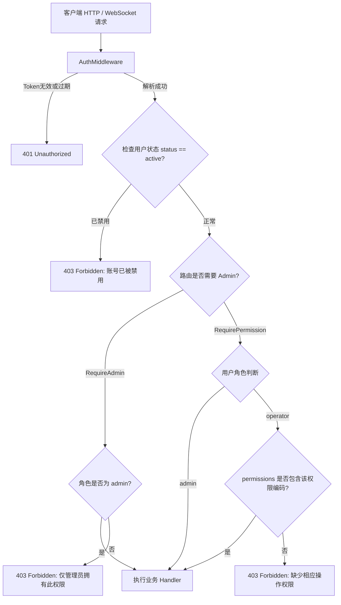

# OpsHub 轻量级双角色权限控制与运维人员管理设计说明书

## 1. 概述与背景 (Overview & Background)

### 1.1 需求背景
OpsHub 是一个面向单服务器的 Java 服务与中间件部署运维平台。随着平台在生产环境的实际应用，运维团队往往由具有不同职责的成员组成。为了防止运维误操作并满足生产安全合规要求，平台需要引入一套**轻量、简单且开箱即用**的权限控制体系。

### 1.2 核心目标 (Goals)
1. **明确的双角色模型**：
   - **超级管理员 (`admin`)**：拥有系统全量控制权，具备用户管理、权限调配与系统安全配置能力。
   - **运维操作员 (`operator`)**：默认具备日常维护服务的能力（查看状态、日志、监控指标、启停、重启、发版部署、版本回滚、查看与导出审计日志等），但严禁访问用户管理与底层系统安全配置。
2. **管理员可自定义运维人员权限**：
   - 管理员能够在用户管理面板查看所有运维人员，并为其灵活开启或关闭特定的功能权限（例如：允许日常启停但禁止回滚；或仅允许只读巡检）。
3. **开箱即用的默认模板**：
   - 新增运维人员时自动继承“标准运维权限集”，无需每次繁琐手工配置。
4. **前后端全链路双重防护**：
   - 后端路由与中间件层执行严格鉴权拦截，未授权请求直接响应 `403 Forbidden`。
   - 前端菜单与按钮执行动态渲染与友好置灰/提示，防止误触。
5. **系统防自锁与安全保障**：
   - 内置管理员保护机制，禁止删除主管理员账号，禁止修改系统唯一管理员为普通运维人员。

### 1.3 非目标 (Non-Goals)
- 不引入重型企业级 RBAC（不创建角色表、权限字典表、用户组表、继承关系表等多对多架构），保持单文件 SQLite/MySQL 双库零冗余。
- 不引入复杂的动态数据权限（如仅允许查看特定标签的服务实例），当前阶段聚焦于功能操作级权限。

---

## 2. 权限模型与矩阵设计 (Permission Matrix)

### 2.1 角色定义 (Roles)
- `RoleAdmin = "admin"`：平台超级管理员。天然绕过权限点检查（SuperAdmin Bypass）。
- `RoleOperator = "operator"`：运维操作员。其具体操作权限受限于自身配置的 `permissions` 权限集合。

### 2.2 权限标识符规范 (Permission Codes)
所有功能权限采用 `模块:动作` 的标准小写字符串标识：

| 权限编码 | 权限名称 | 归属分类 | Operator默认 | 说明 |
| :--- | :--- | :--- | :---: | :--- |
| `service:view` | 服务只读巡检 | 服务运维 | **开** | 查看服务列表、实例详情、进程指标、实时日志流、发版预检 |
| `service:control` | 服务启停控制 | 服务运维 | **开** | 启动 (`/start`)、停止 (`/stop`)、重启 (`/restart`) 服务 |
| `service:deploy` | 服务发版部署 | 服务运维 | **开** | 执行部署发布 (`/deploy`)、上传安装包 (`/artifacts`) |
| `service:rollback` | 服务版本回滚 | 服务运维 | **开** | 执行版本回滚 (`/rollback`) |
| `service:config` | 服务配置修改 | 服务配置 | **开** | 在线编辑保存服务配置文件、修改环境变量与参数 |
| `service:manage` | 服务创建与删除 | 高危管理 | **关** | 新建服务实例 (`POST /services`)、删除服务 (`DELETE /services/:id`) |
| `template:manage` | 部署模板管理 | 资产管理 | **关** | 新建、修改、删除部署模板 (`/templates`) |
| `jdk:manage` | JDK 资产管理 | 资产管理 | **关** | 扫描、登记、注销 JDK 资产 (`/jdks`) |
| `audit:view` | 审计日志查看 | 安全审计 | **开** | 查看系统审计日志列表 (`GET /audit-logs`)、导出 CSV |

### 2.3 管理员独占权限 (Admin Exclusive - 不可赋予 Operator)
以下功能属于系统级安全核心，由代码和中间件强制限定为 `admin` 角色，不在运维人员可勾选权限列表中暴露：
1. **用户与权限管理 (`user:manage`)**：
   - 查看用户列表 (`GET /api/users`)
   - 创建新用户 (`POST /api/users`)
   - 修改指定运维人员权限点 (`PUT /api/users/:id/permissions`)
   - 启用/禁用账号 (`PUT /api/users/:id/status`)
   - 重置他人密码 (`POST /api/users/:id/reset-password`)
   - 删除用户账号 (`DELETE /api/users/:id`)
2. **系统底层安全配置 (`system:config`)**：
   - 数据库切换、端口配置、服务重启与重置等高危操作。

---

## 3. 数据库结构扩展 (Database Schema Migration)

在现有 `users` 表上扩展两个字段，兼容 SQLite 与 MySQL 双数据库驱动：

```sql
-- SQLite & MySQL 共有字段扩展
ALTER TABLE users ADD COLUMN permissions TEXT DEFAULT '';
ALTER TABLE users ADD COLUMN status TEXT NOT NULL DEFAULT 'active';
```

- `permissions`: 存储 JSON 字符串数组，如 `["service:view","service:control","service:deploy","service:rollback","service:config","audit:view"]`。若为空或 NULL，根据用户角色降级为默认权限。
- `status`: 账户状态，可选值：`active`（正常使用）、`disabled`（已禁用/冻结）。当状态为 `disabled` 时，即使持有有效 JWT 亦直接拦截登录与接口访问。

---

## 4. 后端架构与鉴权中间件体系 (Backend Architecture)



### 4.1 中间件设计 (`internal/api/middleware/auth.go`)
1. **`RequireAdmin()`**：
   - 检查 `GetRole(c) == model.RoleAdmin`。若不匹配，中止并响应 `403 Forbidden`。
2. **`RequirePermission(requiredPerm string)`**：
   - 检查 `GetRole(c) == model.RoleAdmin`，若是则直接 `c.Next()` 放行。
   - 若是 `operator`，解析 `claims.Permissions` 或由服务层查询用户权限集；若命中 `requiredPerm` 则放行，否则响应 `403 Forbidden: 缺少 [xxx] 操作权限`。
3. **`RequireActiveUser(db *sql.DB)`**：
   - 在认证通过后校验用户当前是否处于有效激活状态。

### 4.2 用户与权限管理接口设计 (`UserHandler`)
新建独立处理类 `UserHandler`，所有子路由强制挂载 `RequireAdmin()` 中间件：
- `GET /api/users`：分页/列表获取用户（包含 ID, 用户名, 昵称, 角色, 权限集列表, 状态, 创建/更新时间）。
- `POST /api/users`：创建新用户（支持设置初始密码、角色、权限集）。
- `PUT /api/users/:id/permissions`：更新指定运维人员的权限集合。
- `PUT /api/users/:id/status`：更新账号状态（`active` / `disabled`），禁止禁用主管理员。
- `POST /api/users/:id/reset-password`：管理员重置用户密码。
- `DELETE /api/users/:id`：删除用户，禁止删除管理员或自删当前登录账号。

### 4.3 现有 API 路由权限收口加固 (`internal/api/router.go`)
- **公共接口**：登录、初始化管理员、找回密码安全问题等保持公开。
- **个人中心**：修改个人资料、修改个人密码，所有已激活用户均可访问。
- **服务查看与监控**：保护为 `RequirePermission("service:view")`。
- **服务启停控制**：保护为 `RequirePermission("service:control")`。
- **发版与上传包**：保护为 `RequirePermission("service:deploy")`。
- **服务回滚**：保护为 `RequirePermission("service:rollback")`。
- **服务配置修改**：保护为 `RequirePermission("service:config")`。
- **服务新建与删除**：保护为 `RequirePermission("service:manage")`（或限制为 `RequireAdmin()`）。
- **模板管理**：保护为 `RequirePermission("template:manage")`。
- **JDK 资产管理**：保护为 `RequirePermission("jdk:manage")`。
- **审计日志**：保护为 `RequirePermission("audit:view")`。
- **用户管理模块**：全局保护为 `RequireAdmin()`。

---

## 5. 前端架构与交互设计 (Frontend Architecture)

### 5.1 权限状态与 Hook 抽象 (`usePermission.ts`)
扩展 `UserProfile` 类型定义：
```typescript
export interface UserProfile {
  id: number;
  username: string;
  role: 'admin' | 'operator';
  permissions: string[];
  status: 'active' | 'disabled';
  nickname?: string;
  email?: string;
  avatar?: string;
  // ...
}
```
提供自定义 Hook `usePermission()`：
- `isAdmin: boolean`
- `can(permission: string): boolean`
- `canAny(permissions: string[]): boolean`

### 5.2 侧边栏导航控制 (`Shell.tsx`)
- 当 `currentUser.role === 'admin'` 时，侧边栏动态追加「用户管理」导航项（图标：`Users`，路由：`/users`）。
- 当 `currentUser.role === 'operator'` 时，侧边栏隐藏「用户管理」导航项；若直接在地址栏输入 `/users`，通过路由守卫重定向回 `/services`，并弹出警告提示。

### 5.3 按钮级权限门禁组件 (`PermissionGate.tsx`)
封装轻量级权限包装组件：
```tsx
<PermissionGate 
  permission="service:control"
  fallback={<Button disabled title="您暂无服务控制权限，请联系管理员">启动</Button>}
>
  <Button onClick={handleStart}>启动</Button>
</PermissionGate>
```
在无权限时，可根据场景选择“直接隐藏”或“置灰并给出 Tooltip 提示”。

### 5.4 用户与权限管理界面 (`pages/Users/UserManagement.tsx`)
1. **用户列表卡片/表格**：
   - 展示用户名、昵称、角色徽章（管理员/运维人员）、账号状态（正常/已禁用）、权限点标签摘要。
   - 操作按钮：【编辑权限】、【重置密码】、【禁用/启用】、【删除】。
2. **“编辑权限”抽屉/模态框**：
   - 快捷预设按钮：
     - **【标准运维权限（默认）】**：一键勾选日常巡检、启停、发版、回滚、配置和审计。
     - **【只读巡检权限】**：仅勾选服务查看和审计日志。
     - **【全功能运维】**：勾选除用户管理外的所有服务及模板资产权限。
   - 细粒度复选框列表：按模块分组（服务运行、发版与回滚、配置管理、模板资产、审计日志），支持单个勾选与取消。

---

## 6. 安全性与防自锁保障 (Security & Guardrails)

1. **主管理员不可篡改原则**：
   - 用户名为 `admin` 的内置账号角色不可被更改为 `operator`。
   - 任何管理员不可删除自身账号。
   - 数据库中至少保持 1 个活跃的 `admin` 账号。
2. **禁用账号即时阻断**：
   - 运维账号被管理员置为 `disabled` 后，后续所有请求（包括已建立的 WebSocket 日志流）即时阻断，Token 失效。
3. **完备的审计留痕**：
   - 任何用户创建、权限变更、密码重置、账号冻结均通过 `middleware.AuditMiddleware` 自动记入 `audit_logs` 表，形成不可篡改的变更轨迹。

---

## 7. 测试与验证计划 (Testing & Verification Strategy)

1. **后端自动化测试**：
   - 中间件鉴权单元测试：覆盖 `RequireAdmin` 与 `RequirePermission` 的放行、无权限 403、Token 缺失 401 场景。
   - 用户服务单元测试：测试用户增删改查、默认权限赋予、权限修改、密码重置、自删保护逻辑。
   - API 路由集成测试：以 `admin` 和 `operator` 两个角色分别请求敏感接口，验证权限边界。
2. **前端自动化测试**：
   - 权限 Hook 单元测试：验证 `can()` 在不同角色及权限列表下的输出。
   - 路由与组件测试：验证非管理员访问 `/users` 被重定向；验证未授权按钮置灰或隐藏。
3. **全流程回归**：
   - 运行全量 `go test ./...` 和前端 `npm test`，确保原有全部测试 100% 通过。
